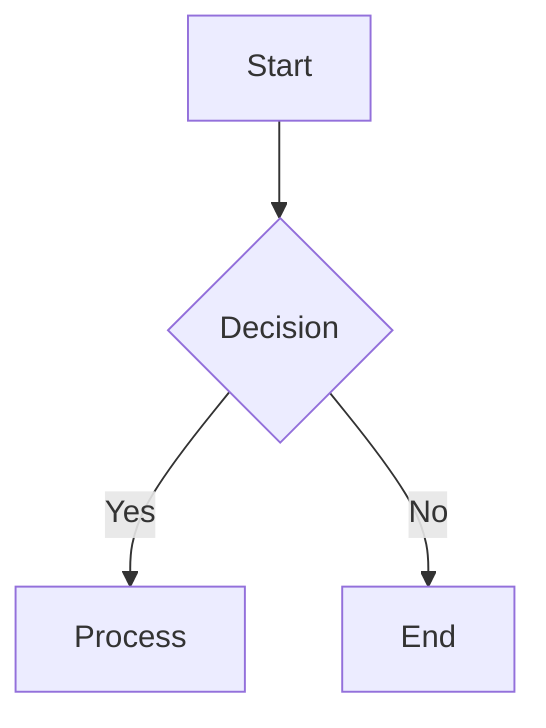

# MD Converter

[](https://python.org)
[](https://opensource.org/licenses/MIT)

**MD Converter** 是一个生产级 Markdown → Word 文档编译器，采用真正的编译器架构（Parser → AST → Pipeline → Renderer）。它将 Markdown 文档编译为格式精美的 Word (.docx) 文档，支持标题、列表、表格、代码块、Mermaid 图表、ASCII 结构图等丰富的 Markdown 特性。

## ✨ 特性

- 📝 **完整的 Markdown 支持**：标题、段落、列表（有序/无序）、表格、代码块、引用块、水平分割线
- 🎨 **行内样式**：粗体、斜体、行内代码、链接、图片
- 📊 **图表渲染**：
  - **Mermaid 图表** → PNG（通过 mmdc 或 Playwright）
  - **ASCII 结构图** → 自动转换为最合适的 Mermaid 图表（流程图 / 时序图 / 类图 / 思维导图），再渲染为 PNG
  - **多方案优选**：自动检测类型，支持交互式选择与多方案预览
- 📑 **自动化文档生成**：
  - 封面页（基于 Frontmatter 的 title、date、tags）
  - 自动目录（TOC）
  - 自动分页（封面 → TOC → 正文）
- 🔧 **编译器架构**：
  - 不可变 AST，支持缓存和增量编译
  - Pipeline + Pass 机制，可插拔扩展
  - 插件系统（通过 entry_points）
- 🎯 **主题与样式**：
  - 默认主题 **QS-Word-Default-V1.5**（冻结）：适合中英文混排
  - 中英分字体渲染：中文 DengXian / Microsoft YaHei，西文 Calibri / Arial
  - 语言自适应对齐：中文两端对齐、西文左对齐
  - LayoutPlan 决策引擎 + 双层 QA（Static / Rendered）+ 修复闭环
  - 标题 Keep with next、表格跨页重复表头、数字列右对齐
  - 统一字体设置（支持东亚字体，避免 MS Mincho）
  - 表格样式（边框、表头背景色）
- 🐛 **诊断与测试**：
  - 完整的诊断系统（Severity + Code + Location + Suggestion）
  - Golden Test 回归测试
  - Canonical Acceptance Corpus（AC001–AC015）
- 🛡️ **模型治理（Minimal Governance Engineering）**：
  - `CANONICAL_SPEC.md`：唯一 Canonical Authority（Spec 1.0，FROZEN）
  - `REVIEW_TEMPLATE.md`：Change Classification Gate（DEFECT / SPEC_GAP / ARCH_CHANGE …）
  - `IMPLEMENTATION_PLAN.md`：Traceable Implementation Plan（SPEC → IMP → Code → Test）
  - 质量门：StaticQA / RenderedQA / FinalArtifactQA（FAIL 不得静默通过）
  - Release Evidence：`RELEASE_EVIDENCE.md` + `release_evidence.json`
- 🚀 **高性能**：
  - 迭代式 Inline 构建，避免递归深度限制
  - NormalizePass 合并相邻文本，减少冗余

---

## 📦 安装

### 依赖

- Python 3.8+
- Word COM (Windows) 用于 TOC 自动更新（可选，`pip install -e ".[windows]"`）

### 安装步骤

```bash
# 克隆仓库
git clone https://github.com/yourusername/md_converter.git
cd md_converter

# 创建虚拟环境（推荐）
python -m venv .venv
source .venv/bin/activate   # Linux/macOS
# 或 .venv\Scripts\activate  # Windows

# 安装包（开发模式）
pip install -e .
```

### 额外依赖（可选）

### Mermaid / Golden Renderer

```powershell
python -m pip install -e ".[mermaid]"
python -m playwright install chromium
```

### Windows Word COM

```powershell
python -m pip install -e ".[windows]"
```

> Word COM 用于 Windows 环境下自动刷新 TOC 页码。

### 生成 Release Evidence

```bash
# 先运行测试并生成测试报告（示例）
md-converter-release-evidence README.md \
  --test-report tests_report.json \
  --governance-report governance_evidence.json
```

`release-evidence` 命令在编译成功后生成 `RELEASE_EVIDENCE.md` 与
`release_evidence.json`；当证据规则判定为 `RELEASE_BLOCKED` 时以退出码 1 结束。
Release 采用 Default Deny：Required Test Suite 缺一不可、治理指标未检测
（NOT_CHECKED / UNKNOWN）即 BLOCK。

治理证据（`governance_evidence.json`）必须包含审计来源：
`checked_at`（ISO-8601）、`checked_by`、`mechanism`（有限集合），
以及 regression 的 `baseline` / `current` 比较对象；所有计数必须为非负整数
（负数会被 schema 拒绝，且 Release Predicate 使用 `!= 0` 防御）。

Golden 测试环境契约见 [GOLDEN_ENVIRONMENT.md](GOLDEN_ENVIRONMENT.md)：
baseline 记录 `renderer_backend`，在缺 Mermaid renderer 的环境会显式失败，
不得跨环境拿同一条 baseline 假装通过。

Canonical Golden renderer 为 Playwright + Chromium（`pip install -e ".[mermaid]"`
并执行 `python -m playwright install chromium`，版本精确 pin
`playwright==1.62.0`）；
ASCII 转换测试 fixture 已固化在 `md_converter/tests/fixtures/`，
Full Regression 不依赖工作区 `input/` 目录。

最终 RC 证据包位于 `RC_EVIDENCE/`（RELEASE_EVIDENCE.md、
release_evidence.json、governance_evidence.json、test_report.json、
golden_environment_report.json、full_pytest_summary.txt）；
`md_converter/tests/golden_environment.py` 提供 Golden 环境 preflight
（真实 headless Chromium launch，不满足必须 FAIL、不允许 SKIP）。

工具链：

- `tools/project_merger.py`：项目快照生成器（文件名过滤 + 内容秘密扫描 +
  排除 `.egg-info/input/input_test/output`；`--self-test` 自测）。
- `tools/rc_evidence_check.py`：RC Evidence Package 一致性检查
  （`RC_EVIDENCE/` 为唯一正式 Release Evidence 位置）。

`RC_EVIDENCE/` 是唯一正式 RC Evidence Package。

Current Release Candidate:

`RC-20260901-05`

Supersedes:

`RC-20260831-04`

根目录不再保留 evidence 副本，防止多套证据漂移。

---

## 🚀 快速开始

### 命令行使用

```bash
# 基本转换
md-converter input.md

# 默认编译 PROJECT_ROOT/input/ 下所有 .md（批量）
md-converter

# 指定目录批量编译
md-converter input/

# 转换并打开文档
md-converter input.md --open

# 指定输出路径
md-converter input.md --output ./output/result.docx

# 使用配置文件
md-converter input.md --config config.yaml

# 详细输出
md-converter input.md --verbose

# ASCII 图自动转 Mermaid（默认 auto）
md-converter input.md --ascii-mode auto

# 复杂图表：交互式选择最佳方案
md-converter input.md --ascii-mode interactive

# 多方案预览：输出全部候选 Mermaid 方案与报告
md-converter input.md --ascii-mode preview --ascii-preview-dir ./preview
```

### Python API

```python
from md_converter import compile_file

# 编译 Markdown 文件
doc = compile_file("input.md", config={"output_dir": "./output"})
doc.save("output.docx")
```

### 示例 Markdown

```markdown
---
title: My Document
date: 2024-01-15
tags: [example, markdown]
---

# Heading 1

This is **bold** and *italic* text.

## Lists

- Item 1
- Item 2
  - Sub-item 2.1

## Tables

| Header 1 | Header 2 |
|----------|----------|
| Cell 1   | Cell 2   |

## Code Blocks

```python
def hello():
    print("Hello, World!")
```

## Mermaid Diagram



## ASCII Diagram

```ascii
┌─────────────┐
│   Module    │
├──────┬──────┤
│ Sub1 │ Sub2 │
└──────┴──────┘
```
```

### ASCII 图自动转 Mermaid

MD Converter 基于规则引擎自动识别 ASCII 结构图并转换为最合适的
Mermaid 图表，支持四种类型与自动类型检测：

- **流程图 (flowchart)**：识别方框与箭头，自动推断 TD/LR 方向；
  “标题 + 内容”信息盒默认转为 `flowchart` + `subgraph`，以 `：` 结尾的
  行自动生成嵌套分节（如 输入/输出）
- **时序图 (sequence)**：识别生命线与消息箭头
- **类图 (class)**：识别分节方框、可见性标记与 UML 关系
- **目录/层级树**：转换为 `flowchart`，文件夹/文件带 📁/📄 图标与配色
- **思维导图 (mindmap)**：识别缩进 / 树形分支文本

#### 转换模式

| 模式 | 说明 |
|------|------|
| `auto`（默认） | 规则引擎自动优选最高置信度方案，确定性输出 |
| `interactive` | 每个 ASCII 图逐图确认/选择转换方案 |
| `preview` | 生成全部候选方案（`.mmd` + 报告），并采用最优方案 |

配置示例（`config.yaml`）：

```yaml
ascii_to_mermaid:
  enabled: true
  mode: auto          # auto | interactive | preview
  confidence_threshold: 0.30
  preview_dir: output/ascii_preview
```

---

## 🎯 配置

### 配置文件 (`config.yaml`)

```yaml
# 输出目录
output_dir: ./output

# 主题（default, github, academic, corporate）
theme: default

# 是否启用 NormalizePass
normalize: true

# 是否启用 DiagramPass
diagram: true

# 封面页
enable_cover: true

# 表格样式
style_tables: true

# 目录更新（需 Windows + Word COM）
update_toc: true

# 详细日志
verbose: false

# 图片宽度（英寸）
image_width: 5

# 页面边距（厘米）
page_margins:
  top: 2.5
  bottom: 2.5
  left: 2.5
  right: 2.5
```

---

## 📁 项目结构

```
md_converter/
├── ast/                # 不可变 AST 节点
├── parser/             # Markdown → AST 解析器
│   └── builders/       # Builder 模式构建 AST
├── pipeline/           # Pass 管道
│   └── passes/         # 内置 Pass（Normalize, Diagram）
├── renderer/           # Word 渲染器
│   └── themes/         # 主题定义
├── services/           # 服务层（DiagramService）
├── diagnostics/        # 诊断系统
├── utils/              # 工具函数
├── tests/              # 测试（含 Golden Test）
├── cli.py              # 命令行入口
├── compiler.py         # 编译器上下文
└── config.py           # 配置加载
```

---

## 🧪 测试

```bash
# 运行所有测试
pytest tests/

# 运行 Golden Test
pytest tests/test_golden.py -v

# 更新 Golden Test 期望值
pytest tests/test_golden.py --update-golden

# 运行特定测试
pytest tests/test_parser.py

# 生成覆盖率报告
pytest --cov=md_converter --cov-report=html tests/
```

---

## 🔌 插件开发

### 创建自定义 Pass

```python
# my_plugin.py
from md_converter.pipeline.passes.base import TransformPass, PassResult
from md_converter.ast.nodes import Node
from md_converter.diagnostics.collector import DiagnosticCollector

class MyCustomPass(TransformPass):
    def run(self, document: Node, diag: DiagnosticCollector) -> PassResult:
        # 转换 AST
        new_doc = self._transform(document)
        return PassResult(document=new_doc)
```

### 注册插件

在 `pyproject.toml` 的 `[project.entry-points."md_converter.passes"]`
中注册：

```toml
[project.entry-points."md_converter.passes"]
my_pass = "mypackage.my_plugin:MyCustomPass"
```

---

## 🤝 贡献

欢迎贡献！请阅读 [CONTRIBUTING.md](CONTRIBUTING.md) 了解开发流程、代码规范和测试要求。

### 开发环境

```bash
pip install -e ".[dev]"
```

### 代码规范

- 使用 `black` 格式化代码
- 使用 `isort` 排序导入
- 使用 `mypy` 进行类型检查
- 所有公共 API 需要有 docstring

---

## 📄 许可证

本项目采用 MIT 许可证。详见 [LICENSE](LICENSE) 文件。

---

## 🙏 致谢

- [markdown-it-py](https://github.com/executablebooks/markdown-it-py) - Markdown 解析引擎
- [python-docx](https://github.com/python-openxml/python-docx) - Word 文档生成
- [Mermaid](https://mermaid.js.org/) - 图表渲染

---

## 📞 联系方式

- 项目主页: [GitHub](https://github.com/yourusername/md_converter)
- 问题反馈: [Issues](https://github.com/yourusername/md_converter/issues)
- 邮箱: support@mdconverter.io

---

**MD Converter** — 让 Markdown 文档编译为专业 Word 文档变得简单而强大。
