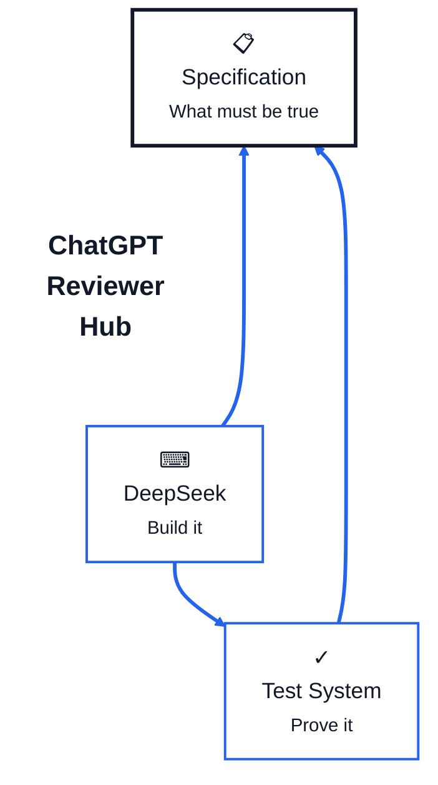
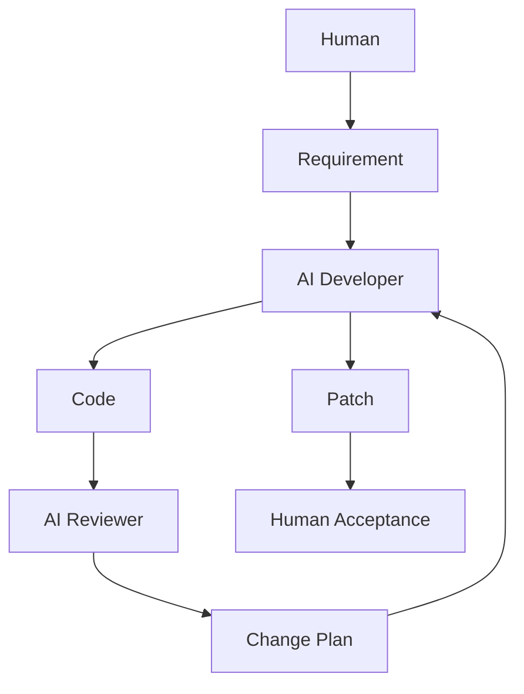
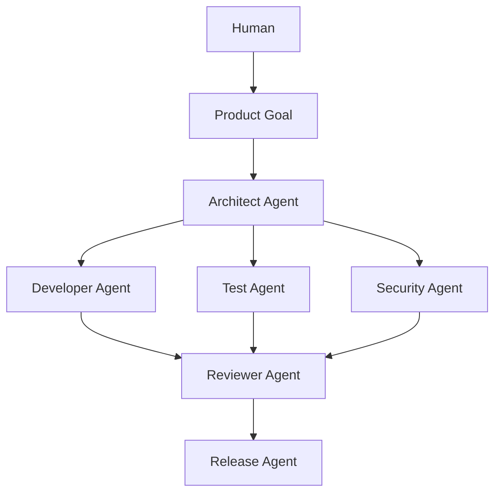

# 分析以AI工具为主的应用系统开发方式应注意哪些事项

分析以AI工具为主的应用系统开发方式应注意哪些事项？当前做法：架构设计采用chatGPT与Deepseek相互评价、迭代优化，直到版本冻结；开发阶段使Deepseek
API做出模块与代码；审查与优化分析、制定修改计划使用ChatGPT，执行修改计划，如增加、修改、删除代码与模块等使用Deepseek
API。

## 多模型协同开发流程

你现在这套方式，本质上已经不是"用 AI 辅助写代码"，而是在搭建一种
**AI-first Software Engineering /多模型协同开发流程**。方向是对的，而且比"让一个模型从头写到尾"成熟很多。

但真正需要注意的是：**AI
可以承担大量设计、编码、审查和修改工作，但不能让"模型意见"替代工程治理。**
你目前流程里最需要补强的，不是再加一个更强模型，而是加入"独立事实层、可执行验证层、变更治理层"。

你当前流程可以概括为：

> ChatGPT ↔ DeepSeek：架构互审 → 迭代 → Freeze\
> DeepSeek API：实现模块/代码\
> ChatGPT：代码审查、系统分析、制定修改计划\
> DeepSeek API：执行修改

这个模型分工是合理的，但我建议升级成下面这种结构：

``` text
需求 / System Goals
        │
        ▼
Architecture Spec
        │
        ├──── ChatGPT Critic
        │
        └──── DeepSeek Critic
        │
        ▼
Architecture Decision Record
        │
        ▼
Architecture Freeze
        │
        ▼
Implementation Plan
        │
        ▼
DeepSeek API → Code
        │
        ▼
Static Check / Unit Test / Integration Test
        │
        ▼
ChatGPT Review
        │
        ▼
Change Plan
        │
        ▼
DeepSeek API Patch
        │
        ▼
Regression / Ablation / Acceptance Test
        │
        ▼
Release Candidate
```

这里最关键的变化是：

> **AI Review 后面必须有 Machine-verifiable Gate。**

否则很容易变成：

> AI 写代码 → AI 觉得代码不错 → 另一个 AI 也觉得不错 → 实际运行有问题。

------------------------------------------------------------------------

## 你这套开发方式最需要注意的 10 个事项

| 优先级 | 事项 | 你当前可能存在的问题 | 建议 |
| --- | --- | --- | --- |
| P0 | Specification 是最高权威 | ChatGPT/DeepSeek意见可能逐渐改变系统目标 | 建立正式 System Spec |
| P0 | AI不能自己证明自己正确 | AI写、AI审、AI改形成闭环幻觉 | 加测试和确定性验证 |
| P0 | 架构 Freeze 后控制漂移 | 修复过程中重新设计架构 | Architecture Guard |
| P0 | 修改必须最小化 | AI容易顺便重构 | Patch Scope约束 |
| P0 | Regression Testing | 改A坏B | 每次修改自动回归 |
| P1 | 多模型不是天然独立 | ChatGPT和DeepSeek可能犯相似错误 | 引入事实/测试第三方 |
| P1 | Context污染 | 长session让模型继承旧假设 | 阶段性新Session |
| P1 | 修改可追溯 | 不知道为什么改了某段代码 | Change Manifest |
| P1 | Prompt版本治理 | Prompt本身改变行为 | Prompt Versioning |
| P1 | AI成本/复杂度膨胀 | 模型喜欢"完善架构" | Complexity Budget |

其中最重要的是前三项。

------------------------------------------------------------------------

### 1. 不要把 AI Consensus 当成 Architecture Correctness

你现在采用：

> ChatGPT设计 → DeepSeek评价 → ChatGPT修改 → DeepSeek再评价 → Freeze

这比单模型好很多，但存在一个非常隐蔽的问题：

#### 两个模型达成一致 ≠ 架构正确

因为 ChatGPT 和 DeepSeek
都学习了类似的软件工程知识，其判断可能高度相关。

例如两个模型可能都建议：

``` text
Event Bus
Repository Layer
Service Layer
Domain Layer
Policy Engine
FSM
Feature Store
Adapter Layer
Plugin Layer
```

从架构美感来看非常完整。

但是实际系统可能只需要：

``` text
Data
 ↓
Feature
 ↓
Decision
 ↓
Risk
 ↓
Output
```

结果就会出现典型的：

> **AI-induced overengineering**

这在 AI 开发里非常常见。

因此架构 Freeze 的条件不要是：

> 两个 AI 都认为 Architecture OK。

而应该是：

``` text
Architecture Freeze =
    Requirement Coverage
  + Complexity Acceptable
  + Testability
  + Observability
  + Failure Isolation
  + Performance Budget
  + Human Acceptance
```

------------------------------------------------------------------------

### 2. 建立一个"AI不能修改"的 System Constitution

这是整个 AI-first 开发体系最重要的文件之一。

可以叫：

``` text
SYSTEM_CONSTITUTION.md
```

它不是架构文档。

而是规定：

``` text
系统到底为什么存在
系统绝不能做什么
哪些原则优先级最高
哪些模块有最高权限
哪些规则不可被AI重构
```

例如：

``` text
System Goals

G1 Correctness
G2 Determinism
G3 Auditability
G4 Backtestability
G5 Maintainability

Priority:

Correctness
> Governance
> Explainability
> Performance
> Architecture Elegance
```

再例如：

``` text
AI MUST NOT:

- change decision semantics without explicit approval
- weaken risk controls
- silently change database schema
- change public API contracts
- introduce dependencies without justification
- refactor unrelated modules
```

这可以解决一个非常大的问题：

> AI优化着优化着，把系统目标优化掉了。

------------------------------------------------------------------------

### 3. 把模型角色固定，而不是让模型随意切换角色

你的 ChatGPT / DeepSeek 分工已经不错。

建议进一步正式化：

``` text
ChatGPT
=
Architect
+ Reviewer
+ Risk Analyst
+ Change Planner

DeepSeek
=
Implementation Agent
+ Refactoring Agent
+ Patch Executor
```

非常重要的一点：

#### 尽量不要让同一个模型同时担当：

``` text
Author
Reviewer
Judge
```

例如：

``` text
DeepSeek写代码
↓
DeepSeek评价自己的代码
↓
DeepSeek修改
```

这种闭环风险很高。

你的做法：

``` text
DeepSeek写
↓
ChatGPT审
↓
DeepSeek改
```

其实已经是一个不错的 **Maker--Checker Pattern**。

建议继续保持。

------------------------------------------------------------------------

### 4. ChatGPT 修改计划必须变成 Machine-readable Change Plan

不要只让 ChatGPT 输出：

> 修改 module A\
> 优化 function B\
> 重构 class C

应该强制输出结构化 Change Manifest，例如：

``` yaml
change_id: CHG-20260829-017

objective:
  fix data health turnover logic

scope:
  - health_check.py
  - validator.py

allowed_changes:
  - turnover validation
  - invalid price filtering

forbidden_changes:
  - database schema
  - signal logic
  - FSM
  - API contract

expected_behavior:
  daily_turnover_rate:
    max: 100

  monthly_turnover_rate:
    max: null

tests_required:
  - unit
  - regression

risk_level: LOW
```

然后 DeepSeek API：

> **只能根据这个 Manifest 修改。**

这样 AI 就不会"顺手优化"几十个模块。

------------------------------------------------------------------------

### 5. 强制 DeepSeek 使用 Patch，而不是随意重写文件

AI代码开发最大的风险之一就是：

> 一个小问题 → AI重写整个module。

这很危险，因为 Diff 太大。

建议规则：

``` text
Preferred:
minimal patch

Avoid:
full file rewrite
```

例如要求：

``` text
Maximum patch scope:

≤ 3 files
≤ 150 changed LOC
```

超过阈值：

``` text
Require architecture review
```

这会显著提高系统稳定性。

------------------------------------------------------------------------

### 6. 建立 AI → Test → AI，而不是 AI → AI

你的当前流程可能近似：

``` text
DeepSeek Code
    ↓
ChatGPT Review
    ↓
DeepSeek Modify
```

建议变成：

``` text
DeepSeek Code
    ↓
Compiler / Linter
    ↓
Unit Test
    ↓
Integration Test
    ↓
Regression Test
    ↓
ChatGPT Review
    ↓
DeepSeek Patch
```

换句话说：

**ChatGPT应该审"代码 + 测试结果"，而不仅仅审代码。**

例如输入：

``` text
Code Diff
Test Report
Coverage
Performance Benchmark
Logs
```

ChatGPT 才有足够证据判断。

------------------------------------------------------------------------

### 7. Architecture Freeze 不能意味着 Architecture 永远不变

Freeze 应该定义成：

``` text
Baseline Architecture
```

而不是：

``` text
Never Change
```

建议 Architecture 有版本：

``` text
ARCH-1.0
ARCH-1.1
ARCH-2.0
```

只有满足明确条件才能修改：

``` text
Architecture Change Request
        │
        ▼
Impact Analysis
        │
        ▼
ChatGPT Review
        │
        ▼
DeepSeek Counter-review
        │
        ▼
Human Approval
        │
        ▼
Architecture Version++
```

避免代码修改时发生：

> stealth architecture change

也就是代码已经改变架构，但架构文档没变。

------------------------------------------------------------------------

### 8. 长 Session 是 AI 开发一个很容易被忽视的问题

你之前提到过一个开发会话可能持续两周、包含大量架构、开发、审查和优化讨论。对于
AI 工程，这是一个很重要的问题。

长 Context 会产生：

``` text
Context Drift
Assumption Accumulation
Instruction Collision
Historical Bias
Obsolete Decisions
```

尤其容易出现：

> AI依据几天前已经被废弃的设计继续分析。

更好的方式是阶段性开新 Session：

``` text
Session A
Architecture

Session B
Implementation

Session C
Review

Session D
Optimization
```

但不是每次重新解释整个项目。

而是维护几个 **Canonical Documents**：

``` text
SYSTEM_CONSTITUTION.md
ARCHITECTURE.md
DECISION_LOG.md
MODULE_MANIFEST.md
TEST_SPEC.md
CURRENT_STATE.md
```

新的 ChatGPT session 先读取这些。

这比依赖 Chat History 稳定得多。

------------------------------------------------------------------------

### 9. 必须治理 Prompt，本质上 Prompt 也是代码

如果 DeepSeek API 大量承担编码工作，那么 prompt 实际已经成为：

> Source Code Generator Configuration

所以必须版本控制，例如：

``` text
prompts/
    architecture_review_v3.md
    implementation_v7.md
    code_review_v5.md
    patch_executor_v4.md
```

每个 Prompt：

``` text
version
purpose
input contract
output contract
constraints
examples
```

甚至可以：

``` text
Prompt Regression Test
```

因为 Prompt 改一个句子，可能导致：

``` text
生成代码风格变化
错误处理变化
重构倾向变化
模块边界变化
```

------------------------------------------------------------------------

### 10. 给 AI 设置 Complexity Budget

这是我认为 AI 开发体系里非常重要但经常被忽视的一点。

AI非常喜欢：

``` text
更多 abstraction
更多 interface
更多 manager
更多 factory
更多 config
更多 engine
```

所以应该建立硬指标：

``` text
Complexity Budget
```

例如：

``` text
New module:
must justify responsibility

New dependency:
must justify necessity

New abstraction:
must have >=2 actual consumers

New config:
must have real variability

New interface:
must solve real decoupling problem
```

否则系统非常容易从：

``` text
20 modules
```

半年后变成：

``` text
120 modules
```

功能却没有增加多少。

------------------------------------------------------------------------

## 我尤其推荐你增加一个"第三裁判"：Deterministic Evidence

你的现有体系是：

``` text
ChatGPT
      ↕
DeepSeek
```

最好升级成三角：

``` text
             GOVERNANCE TRIANGLE

                  Specification
               "What must be true"
                    /       \
                   /         \
                  /           \
                 /  ChatGPT    \
                /   Reviewer    \
               /     Hub         \
              /                   \
             ▼─────────────────────▼
         DeepSeek              Test System
      "Build it"             "Prove it"
```


其中：

``` text
ChatGPT = reasoning authority
DeepSeek = implementation authority
Test System = factual authority
Specification = governance authority
```

优先级应该是：

``` text
Specification
     ↓
Test Evidence
     ↓
Architecture Rules
     ↓
AI Judgment
```

而不是：

``` text
ChatGPT says X
DeepSeek says Y
```

当 AI 与测试冲突：

> **测试结果优先。**

当测试与 Specification 冲突：

> **先判断是测试错还是 Spec 需要变更，而不是让 AI自行决定。**

------------------------------------------------------------------------

## 我会把你当前开发模式升级成 8 个 Gate

最终可以形成：

``` text
Gate 0 — Requirement Gate
          ↓
Gate 1 — Architecture Gate
          ↓
Gate 2 — Implementation Gate
          ↓
Gate 3 — Static Validation
          ↓
Gate 4 — Test Gate
          ↓
Gate 5 — AI Review Gate
          ↓
Gate 6 — Regression Gate
          ↓
Gate 7 — Release Gate
```

其中 AI 只负责其中一部分。

真正让系统可靠的是：

``` text
AI
+
Specification
+
Tests
+
Version Control
+
Change Governance
+
Observability
```

而不是模型数量。

------------------------------------------------------------------------

## 对你当前方案的总体评价

如果按成熟度分级：

``` text
Level 0
人工开发 + AI问答

Level 1
AI Copilot

Level 2
AI Code Generation

Level 3
AI Review + AI Coding

Level 4
Multi-Agent Software Engineering

Level 5
Governed AI Software Factory
```

你现在已经接近：

> **Level 3.5～4**

因为已经出现了明确的：

``` text
多模型互审
角色分工
Architecture Freeze
Review → Change Plan → Execution
```

下一步不要继续增加更多 AI Agent，而应该补：

``` text
Specification Governance
Change Manifest
Regression Gate
Architecture Guard
Prompt Versioning
Evidence-based Review
```

一旦这些完善，你的模式就会从：

> **"AI帮助开发系统"**

逐渐变成：

> **"受治理的 AI Software Engineering Pipeline"。**

而对于你这种模块较多、持续审查和迭代的系统，我认为尤其应该坚持一个原则：

> **AI负责产生候选方案，人/规范负责授权，测试负责证明，Git负责记忆。**

这是整个体系最值得长期保留的设计原则。

---

# 解释不同成熟度等级的特点

解释不同成熟度等级的特点。
Level 0 人工开发 + AI问答

Level 1 AI Copilot

Level 2 AI Code Generation

Level 3 AI Review + AI Coding

Level 4 Multi-Agent Software Engineering

Level 5 Governed AI Software Factory


可以把这 6 个等级理解为：**AI从"顾问"逐步变成"受治理的软件生产系统"**。真正的分界不只是"AI
写了多少代码"，而是 **AI的权限、协作方式、验证机制、治理程度和自动化闭环程度**。

| 等级 | 核心模式 | AI角色 | 人的角色 | 最大特点 |
| --- | --- | --- | --- | --- |
| Level 0 | 人工开发 + AI问答 | 顾问 | 全程主导 | AI不直接进入工程流程 |
| Level 1 | AI Copilot | 助手 | 编码主导 | 人写、AI辅助 |
| Level 2 | AI Code Generation | 代码生成器 | 指挥+审查 | AI开始大量写代码 |
| Level 3 | AI Review + AI Coding | 开发者+Reviewer | 决策者 | AI形成开发---审查循环 |
| Level 4 | Multi-Agent SE | 多角色工程团队 | Architect/Governor | 多AI分工、交叉制衡 |
| Level 5 | Governed AI Software Factory | 受治理生产系统 | 治理+最终授权 | Spec→开发→验证→发布形成闭环 |

------------------------------------------------------------------------

## Level 0：人工开发 + AI 问答

这是最基础的模式。

典型流程：

``` text
需求
 ↓
人设计
 ↓
人编码
 ↓
遇到问题
 ↓
问 ChatGPT
 ↓
人理解答案
 ↓
人修改代码
 ↓
人测试
```

例如开发人员问：

``` text
这个 Python Exception 为什么发生？
这个 SQL 如何优化？
这个类应该如何重构？
```

AI只是知识顾问。

### 特点

AI：

-   不理解完整项目
-   不直接控制代码库
-   不连续参与开发
-   不承担修改责任

人：

-   掌握完整 Context
-   决定架构
-   写代码
-   Review
-   测试
-   发布

### 优点

风险最低，而且非常适合解决局部技术问题。

### 缺点

AI生产力提升有限。

核心特征可以概括成：

> **Human builds, AI answers.**

------------------------------------------------------------------------

## Level 1：AI Copilot

Level 1 开始让 AI **进入实际编码过程**。

典型流程：

``` text
人设计
 ↓
人开始编码
 ↓
AI补全代码
 ↓
人接受 / 拒绝
 ↓
AI解释 / 修复
 ↓
人测试
```

例如：

``` python
def calculate_score(data):
```

AI自动生成函数实现。

或者：

> "帮我补这个 class。"

但真正的驾驶员仍然是人。

### AI主要承担

``` text
Code Completion
Boilerplate
Unit Test Generation
Documentation
Simple Refactoring
Bug Fix Suggestion
```

### 人仍然掌握

``` text
Architecture
Module Boundary
Business Logic
Code Acceptance
Testing
Release
```

所以 Copilot 这个词非常准确：

> 人是 Pilot，AI 是 Copilot。

核心特征：

> **Human drives, AI assists.**

------------------------------------------------------------------------

## Level 2：AI Code Generation

Level 2 出现一个明显变化：

> **AI不再只是补代码，而是直接承担完整开发任务。**

例如：

``` text
实现 DataHealthChecker 模块：

输入：
daily_kline

规则：
volume <= 0 删除
price <= 0 删除
monthly turnover_rate > 100 合法

要求：
pytest
logging
type hints
```

AI直接产生：

``` text
data_health_checker.py
test_data_health_checker.py
config.py
```

甚至直接修改 repository。

流程变成：

``` text
Human Requirement
       ↓
AI Implementation
       ↓
Human Review
       ↓
Test
       ↓
Merge
```

### 最大变化

Level 1：

> 人写代码，AI帮助。

Level 2：

> **人描述任务，AI写代码。**

人的工作开始从：

``` text
Coder
```

转变为：

``` text
Task Designer
Reviewer
Integrator
```

### 主要风险

这一级开始出现严重的：

``` text
Hallucinated API
Architecture Drift
Duplicate Logic
Unnecessary Abstraction
Incorrect Assumption
Large Diff
```

所以 Level 2 如果缺少 Review，很容易产生：

> **代码生成速度 \> 人类审查速度**

最终形成大量 AI Technical Debt。

核心特征：

> **Human specifies, AI implements.**

------------------------------------------------------------------------

## Level 3：AI Review + AI Coding

这是一个重要跃迁。

因为 AI 开始同时参与：

> **生产代码 + 审查代码**

但是通常由不同角色、模型或 Session 完成。

典型结构：



例如：

``` text
DeepSeek
    ↓
实现模块
    ↓
ChatGPT
    ↓
审查架构/代码
    ↓
制定修改计划
    ↓
DeepSeek
    ↓
执行修改
```

这已经非常接近你当前采用的主要模式。

### Level 3最大的进步

出现：

> **Maker--Checker Separation**

即：

``` text
Maker != Checker
```

一个 AI 负责生产，一个 AI 负责批判。

这样能够减少：

> "自己写、自己认为自己正确"

的问题。

### 但是仍存在一个根本缺陷

两个 AI 都可能错。

例如：

``` text
DeepSeek:
这个逻辑正确。

ChatGPT:
审查后认为设计合理。
```

但：

``` text
pytest:
FAILED
```

所以 Level 3 最大的问题是：

> **AI Consensus ≠ Ground Truth**

核心特征：

> **AI builds, AI reviews, human decides.**

------------------------------------------------------------------------

## Level 4：Multi-Agent Software Engineering

Level 4 不再只是：

``` text
AI Developer
+
AI Reviewer
```

而是开始形成类似软件工程团队的 **角色化 Agent 系统**。

例如：



每个 Agent 有不同职责。

例如：

### Architect Agent

只负责：

``` text
Architecture
Module Boundary
Interface
Dependency
ADR
```

不能直接修改生产代码。

### Developer Agent

只负责：

``` text
Implementation
Bug Fix
Refactoring
```

### Test Agent

负责：

``` text
Unit Test
Integration Test
Regression Test
Failure Injection
```

### Reviewer Agent

负责：

``` text
Architecture Compliance
Code Quality
Logic Review
Risk Analysis
```

### Security Agent

负责：

``` text
Dependency
Secrets
Injection
Authentication
Authorization
```

------------------------------------------------------------------------

### Level 4真正重要的不是"Agent多"

这是一个很容易产生误解的地方。

不是：

``` text
2个AI = Level 3
10个AI = Level 4
```

而是有没有形成：

> **明确的职责、权限边界和交叉验证机制。**

否则 10 个 Agent 互相讨论，只是：

> 10 个模型制造更多 Token 和更多意见。

一个优秀 Level 4 系统甚至可能只有：

``` text
Architect/Reviewer
Developer
Test/Verifier
```

三个核心角色。

核心特征：

> **AI becomes a software engineering team.**

------------------------------------------------------------------------

## Level 5：Governed AI Software Factory

Level 5 和 Level 4 的区别非常重要。

Level 4关注：

> AI之间如何协作。

Level 5关注：

> **如何证明整个 AI 开发过程是受控的。**

因此 Level 5 的核心不是 Agent，而是：

### Governance

完整流程可能是：

``` text
System Constitution
        ↓
Requirements
        ↓
Specification
        ↓
Architecture
        ↓
Architecture Gate
        ↓
Implementation Plan
        ↓
AI Development
        ↓
Static Validation
        ↓
Unit / Integration Tests
        ↓
AI Review
        ↓
Patch
        ↓
Regression
        ↓
Security
        ↓
Acceptance
        ↓
Release Candidate
        ↓
Human Approval
        ↓
Production
        ↓
Monitoring
        ↓
Evidence
```

每一步都有：

``` text
Input Contract
Output Contract
Authority
Evidence
Pass/Fail Criteria
Audit Trail
```

------------------------------------------------------------------------

### Level 5 最重要的是"Authority"

例如明确规定：

``` text
System Constitution
        ↓
Specification
        ↓
Architecture
        ↓
Test Evidence
        ↓
AI Recommendation
```

AI不能因为"认为这样设计更好"，就自行修改：

``` text
Business Rules
Security Boundary
Decision Semantics
Public API
Database Schema
Risk Policy
```

必须经过正式 Change Request。

于是开发系统从：

> AI自主发挥

变成：

> **AI在明确授权范围内工作。**

------------------------------------------------------------------------

### Level 5 第二个关键：Evidence

每次 AI 修改都应该能够回答：

``` text
为什么修改？
谁提出？
修改什么？
不能修改什么？
修改了哪些文件？
改变多少LOC？
哪些测试通过？
是否发生Regression？
是否改变Architecture？
是否改变Behavior？
如何Rollback？
```

最终形成：

``` text
Change Request
      ↓
Change Manifest
      ↓
Code Diff
      ↓
Test Evidence
      ↓
Review Evidence
      ↓
Approval
      ↓
Release
```

这就是 Software Factory 的含义。

------------------------------------------------------------------------

## 六个 Level 最本质的变化

如果压缩成一句话：

``` text
Level 0
AI知道答案

        ↓

Level 1
AI帮助写代码

        ↓

Level 2
AI负责写代码

        ↓

Level 3
AI写代码 + AI审代码

        ↓

Level 4
AI形成工程团队

        ↓

Level 5
AI工程团队被制度、测试和证据治理
```

还可以从"人的角色"来看：

``` text
Level 0   Programmer
            ↓
Level 1   AI-assisted Programmer
            ↓
Level 2   AI Task Director
            ↓
Level 3   Engineering Reviewer
            ↓
Level 4   AI Engineering Architect
            ↓
Level 5   System Governor
```

这其实是非常重要的变化：

> **AI成熟度越高，人并不是越不重要，而是人的工作从 LOC
> 生产逐渐转向目标、约束、架构、验证和授权。**

------------------------------------------------------------------------

## 一个容易误判的地方：大量使用 AI ≠ Level 5

例如：

``` text
AI生成90%代码
AI自动修改代码
AI自动测试
AI自动部署
```

看起来高度自动化。

但如果没有：

``` text
Canonical Specification
Authority Boundary
Change Control
Regression Gate
Audit Trail
Rollback
Evidence
```

它可能仍然只是：

> **Level 2 的高度自动化版本。**

反过来，一个只有两个 AI 模型的开发体系，如果具备：

``` text
严格Spec
Maker–Checker
Change Manifest
Test Gate
Architecture Guard
Regression Gate
Human Release Authority
```

成熟度可能已经达到 **Level 4+**。

所以真正的成熟度公式更接近：

> **AI Engineering Maturity ≠ Agent数量 × 自动化程度**

而是：

> **Maturity = Capability × Separation of Duties × Verification ×
> Governance × Traceability**

------------------------------------------------------------------------

## 对你当前方式更精确的定位

根据你描述的流程：

``` text
ChatGPT ↔ DeepSeek
架构互审与迭代
        ↓
Architecture Freeze
        ↓
DeepSeek API
实现
        ↓
ChatGPT
Review + Optimization
        ↓
Change Plan
        ↓
DeepSeek API
执行修改
```

它明显已经超过 Level 2，因为存在独立的 **AI Maker / AIChecker**；同时又已经具有 Level 4 的雏形，因为 ChatGPT 与 DeepSeek
开始承担不同工程角色。

所以我会定位为：

> **当前：Level 3.5～4.0**

而不是完整 Level 4，更不是 Level 5。

你现在距离 Level 5 最大的差距，不是"再增加几个
Agent"，而是把现有流程补成：

``` text
System Constitution
        +
Canonical Specification
        +
Architecture Authority
        +
Machine-readable Change Manifest
        +
Automated Test Gate
        +
Regression / Ablation Gate
        +
Architecture Drift Detection
        +
Prompt Version Control
        +
Evidence Package
        +
Release Authority
```

完成这些以后，即使仍然主要只使用 **ChatGPT + DeepSeek API
两个模型**，也完全可以向 Level 5 演进。

换句话说，你下一阶段最值得投入的不是 **Multi-Agent 数量扩张**，而是
**Governance Engineering**。这通常会比再增加第三、第四个编码 Agent
对系统可靠性的提升大得多。

---

# 详解Governance Engineering 的特点

Governance Engineering 可以理解为：

> **把"AI怎么开发软件"从经验做法，升级成有边界、有证据、有审批、有回滚、有追责的软件工程制度。**

它不是普通的项目管理，也不是单纯的代码规范。它解决的是一个更核心的问题：

> 当越来越多设计、编码、审查、修改由 AI 完成时，如何保证 AI
> 不越权、不漂移、不自证正确，并且每次变更都可验证、可追溯、可恢复。

它的典型特点有下面这些。

1.  **Authority-first，而不是 Model-first**
    系统先定义"谁有权决定什么"，再让 AI 工作。例如需求由
    Product/Spec 决定，架构由 Architecture Baseline
    决定，行为正确性由测试证据决定，发布由 Release Authority
    决定。AI只能在被授权范围内提出方案或执行修改，不能因为"模型认为更优"就直接改变业务语义、风险控制、数据结构或接口契约。

2.  **Canonical Source of Truth 唯一化**
    Governance Engineering
    非常强调"一个问题只能有一个最终权威来源"。例如架构只能认
    `ARCHITECTURE.md` 或正式 ADR，业务规则只能认 canonical
    spec，生产决策只能认 canonical decision
    path。聊天记录、模型解释、旧文档、历史代码都不能与当前 authority
    平级。否则很容易出现 duplicate authority。

3.  **Change 必须显式化**
	任何修改都不是"AI顺手优化"，而是一个正式变更对象。典型会包含
    change ID、目标、允许修改范围、禁止修改范围、影响模块、风险等级、测试要求、回滚方式。这样可以把"修改代码"变成"执行受控变更"。

4.  **Scope Control 很严格**
	AI最危险的行为之一是扩大问题边界。原本只是修一个校验条件，AI可能顺便重构类、移动模块、增加
    abstraction、修改接口。Governance Engineering
    会要求最小修改原则，例如限定文件数、LOC、模块、依赖和行为边界。超出阈值就必须重新进入
    Architecture Review。

5.  **Evidence over Opinion**
	不是"ChatGPT认为没问题"或"DeepSeek认为已经修复"，而是必须有证据。证据可能包括
    unit test、integration test、regression test、replay、golden
    test、benchmark、static analysis、failure
    injection、coverage、日志和 diff。模型意见只是 Review Evidence
    的一种，不能成为最终事实。

6.  **Separation of Duties**
	设计者、实现者、Reviewer、Validator、Approver
    尽量不是同一个角色。最简单可以是 DeepSeek 负责实施，ChatGPT
    负责审查，测试系统负责事实验证，人负责最终授权。核心不是模型数量，而是避免
    Author = Reviewer = Judge。

7.  **Architecture Drift
    被当成一等风险**。很多系统不是一次大改后失控，而是几十次"小修小补"逐渐改变架构。Governance
    Engineering 会持续检查依赖方向、模块边界、禁止调用、canonical
    path、legacy path、重复 authority
    等，防止代码已经变成另一套架构而文档仍停留在旧版本。

8.  **Behavioral Compatibility 优先于 Code Elegance**
	一个 patch 代码更漂亮，不代表它更好。治理体系首先问：行为有没有变化、decision
    semantics 有没有变化、历史 replay
    是否一致、边界条件有没有退化。换句话说，优先保护系统行为，而不是追求局部代码美感。

9.  **Risk-based Governance**
	并不是所有修改都需要同样严格的流程。可以把变更分为 LOW
    / MEDIUM / HIGH / CRITICAL。注释修改可能只需要 lint；普通 bug fix
    需要 unit + regression；核心决策链修改则需要 architecture
    review、replay、ablation、failure
    injection、人工批准。这样避免治理流程本身变成官僚主义。

10. **Every Change is Traceable**
	理想状态下，你可以从一段 production
    code 反查：为什么存在、哪次 change 引入、对应哪个
    requirement、谁审查、哪些测试通过、哪个版本发布。如果无法回答，就说明系统存在
    governance debt。

11. **Rollback 是设计的一部分**
	普通开发常把 rollback
    当事故后的措施；Governance Engineering 会在变更前就定义
    rollback。包括 Git commit、schema migration rollback、feature
    flag、旧模型版本、配置版本、数据兼容策略。真正成熟的系统不是"尽量不失败"，而是"失败后可以快速回到可信状态"。

12. **Prompt 也属于受治理资产**
	在 AI-first 开发中，prompt
    决定代码生成行为，所以 prompt 本身应该像源代码一样 version
    control。包括 prompt version、模型版本、system
    instruction、temperature、工具权限、输出
    contract。否则同一个任务今天和下周可能生成完全不同风格的实现，却没有任何可追溯依据。

13. **AI权限最小化**
	不同 Agent 不应拥有相同权限。例如 Reviewer
    可以读整个 repo，但不能写；Developer 可以修改指定文件，但不能改 CI
    配置；Test Agent 可以运行测试但不能改变 expected result；Release
    Agent 不能修改代码。这个思想和数据库 least privilege 非常类似。

14. **Production 和 Experiment 明确隔离**
	实验代码、shadow
    feature、ablation feature、legacy path、research module
    不应该自然进入 production decision path。Governance Engineering
    会明确 ACTIVE、SHADOW、EXPERIMENTAL、DEPRECATED、RETIRED
    等生命周期状态，并规定什么状态可以进入生产链。

15. **Retirement 是真正删除，不只是标记**
	很多系统写了
    `deprecated=True` 或注释"legacy"，但代码仍然存在 production
    tree，最终形成隐藏路径。成熟治理会要求 RETIRED 必须经过 dependency
    scan、reference scan、test、删除、release
    verification，最终确保生产路径中真的消失。

16. **Governance 本身也必须可测量**
	例如可以持续统计 canonical decision
    path 数量、duplicate authority 数量、ACTIVE feature
    数量、decision-critical LOC、legacy production path、unwired active
    feature、escaped failure injection 数量、architecture violations
    等。这样治理不是一句"架构很干净"，而是一组可观察指标。

如果把它压缩成一个公式：

> **Governance Engineering = Authority + Constraints + Evidence +
> Traceability + Approval + Recovery**

而对于 AI-first 系统，还有一个非常重要的额外项：

> **+ AI Permission Boundary**

因此完整一些可以写成：

``` text
Governed AI Engineering
=
Canonical Specification
+ Explicit Authority
+ Scoped Change
+ Independent Verification
+ Separation of Duties
+ Audit Trail
+ Rollback
+ AI Permission Control
```

你可以把它和传统软件工程做一个区别：

  普通软件工程关注   Governance Engineering 额外关注
  ------------------ -------------------------------------------------
  代码是否能运行     AI是否有权这样修改
  测试是否通过       测试是否覆盖正确 authority
  架构是否合理       架构是否发生未授权漂移
  Review是否完成     Reviewer是否独立
  功能是否发布       发布证据是否完整
  Bug是否修复        是否引入新的决策路径
  Git是否有记录      是否能追溯 Requirement→Change→Code→Test→Release

对于你这种 ChatGPT 负责审查和计划、DeepSeek API
负责执行的方式，Governance Engineering
最现实的下一步并不是先建设复杂平台，而是先落实四个东西：

> **System Constitution + Change Manifest + Test Gate + Release
> Evidence**

只要这四个真正执行起来，你的 AI
开发流程就已经会从"AI协作开发"明显迈向"Governed AI Engineering"。

真正成熟的判断标准也很简单：

> **即使今天把 ChatGPT 换成另一个模型、DeepSeek
> 换成另一个模型，整个开发流程仍然受控、可验证、可追溯。**

如果做到这一点，就说明 governance 建立在工程制度之上，而不是建立在某个
AI 模型"足够聪明"之上。

---

# 解释Governance AI Engineering 的定义、目的、原则、对中小规模应用软件开发的指导意义等。

**Governance AI Engineering（治理型 AI 软件工程）**可以定义为：

> **一种把 AI 纳入正式软件工程治理体系的方法论：让 AI
> 参与需求分析、架构设计、编码、审查、测试、优化和发布，但所有 AI
> 行为都受明确权限、规范、验证、审计和变更控制约束。**

它的重点不是"让 AI 更会写代码"，而是：

> **让 AI 生成的软件持续保持可控、可信、可验证、可追溯。**

对于中小规模应用软件，这一点尤其重要，因为中小项目最容易在 AI
高速开发下出现"功能增长很快、结构失控也很快"的问题。

------------------------------------------------------------------------

## 一、Governance AI Engineering 的核心目的

它主要解决 5 类问题：

1.  **防止 AI 越权**\
    AI不能因为"认为更合理"就自行修改业务规则、核心架构、数据库契约、安全边界。

2.  **防止架构漂移**\
    多轮修改以后，代码不能逐渐偏离原始架构和设计目标。

3.  **防止 AI 自证正确**\
    AI写代码、AI审代码、AI说"测试应该通过"是不够的，必须有独立测试和事实证据。

4.  **控制复杂度增长**\
    避免 AI 不断增加 abstraction、manager、factory、engine、config
    和重复路径。

5.  **保证每次变更可追溯、可回滚**\
    要知道为什么改、改了什么、验证了什么、失败以后怎么恢复。

------------------------------------------------------------------------

## 二、它与普通 AI 编程最大的区别

普通 AI 编程通常是：

``` text
需求
 ↓
Prompt
 ↓
AI生成代码
 ↓
人工看看
 ↓
运行
```

Governance AI Engineering 则是：

``` text
System Goals
      ↓
Canonical Specification
      ↓
Architecture / Rules
      ↓
Change Request
      ↓
AI Implementation
      ↓
Independent Validation
      ↓
AI Review
      ↓
Regression Test
      ↓
Approval
      ↓
Release
```

所以它不是：

> AI Coding Method

而更接近：

> **AI Development Operating Model**

即"AI 软件开发的运行制度"。

------------------------------------------------------------------------

## 三、核心原则

如果把 Governance AI Engineering 压缩成几个最重要原则，我建议采用：

> **Authority、Scope、Evidence、Separation、Traceability、Reversibility、Simplicity**

它们基本覆盖了中小软件项目最重要的问题。

### 1. Authority --- 权威必须明确

任何关键问题都必须回答：

> 谁说了算？

例如：

``` text
业务规则 → Specification
架构边界 → Architecture Baseline
接口契约 → API Contract
正确性 → Test Evidence
发布权限 → Release Authority
```

而不是：

``` text
ChatGPT认为……
DeepSeek认为……
```

模型意见不能成为最终 authority。

------------------------------------------------------------------------

### 2. Canonical Source of Truth --- 单一权威来源

同一个规则不能同时存在三四个版本。

例如：

``` text
README
architecture_v2.md
ChatGPT历史对话
代码注释
旧实现
```

如果这些都在描述同一个规则，就很容易发生冲突。

治理型开发要求：

``` text
一个规则
     ↓
一个Canonical Authority
```

例如：

``` text
ARCHITECTURE.md
SYSTEM_SPEC.md
API_CONTRACT.yaml
```

其他资料只能引用它。

------------------------------------------------------------------------

### 3. Scope Control --- AI只能修改授权范围

这是 AI 开发极其重要的一条。

例如任务只是：

> 修正 monthly turnover_rate \> 100 被误判的问题。

AI不应该顺便：

``` text
重构整个Data模块
修改数据库schema
增加Validator framework
修改Feature Pipeline
```

更合理的是：

``` text
Allowed:
data_health.py

Forbidden:
DB schema
feature logic
FSM
API
```

也就是：

> **Small Change → Small Patch**

------------------------------------------------------------------------

### 4. Evidence over Opinion --- 证据高于模型判断

AI可以说：

> 这个修改应该没有影响。

治理体系要求：

> 拿证据。

例如：

``` text
Unit Tests          PASS
Regression          PASS
Golden Replay       PASS
Static Analysis     PASS
Performance         PASS
```

因此最终判断链应该是：

``` text
AI Opinion
     ↓
Test Evidence
     ↓
Acceptance
```

而不是：

``` text
AI Opinion
     ↓
AI Opinion
     ↓
Merge
```

------------------------------------------------------------------------

### 5. Separation of Duties --- 生产者不能完全等于裁判

典型：

``` text
DeepSeek
Developer

ChatGPT
Reviewer

CI/Test
Verifier

Human
Approver
```

这是很好的职责分离。

但重点不是必须使用不同厂商模型，而是：

> **不同角色拥有不同职责和权限。**

------------------------------------------------------------------------

### 6. Traceability --- 所有变化必须能够反查

最好能够形成：

``` text
Requirement
   ↓
Architecture Decision
   ↓
Change Request
   ↓
Code Diff
   ↓
Tests
   ↓
Review
   ↓
Release
```

以后看到一段代码，可以回答：

> 为什么存在？

看到一个 Feature，可以回答：

> 哪个需求引入？

看到一次异常，可以回答：

> 哪个版本改变了行为？

------------------------------------------------------------------------

### 7. Reversibility --- 所有重要变更都应该可恢复

AI开发速度越快，这一原则越重要。

任何重大修改最好都有：

``` text
Git commit
Rollback point
Migration strategy
Config version
Feature flag
```

治理成熟的系统不是保证：

> 永远不会犯错。

而是保证：

> **犯错之后容易发现，而且能够快速恢复。**

------------------------------------------------------------------------

### 8. Simplicity First --- 治理的目的不是制造流程

这一点对中小项目尤其重要。

Governance AI Engineering 很容易走向另一个极端：

``` text
30个Agent
50份文档
20个Gate
复杂审批系统
```

最后治理成本比开发成本还高。

因此中小软件应该坚持：

> **Minimum Effective Governance**

也就是：

> 用最少制度，控制最大的风险。

------------------------------------------------------------------------

## 四、Governance AI Engineering 对中小应用开发最大的指导意义

大型企业的软件工程通常已经有：

``` text
Architecture Board
Security Team
QA Team
DevOps Team
Release Management
Compliance
```

但中小项目可能只有：

``` text
1～5人
+
ChatGPT
+
DeepSeek / Codex / Claude 等
```

AI出现以后，一个很有意思的变化是：

> **小团队拥有了接近大团队的软件生产能力，但没有大团队对应的治理体系。**

这正是风险所在。

例如过去一个人一天可能只能修改：

``` text
500 LOC
```

现在 AI 可能一天产生：

``` text
5,000～20,000 LOC
```

人的 review capacity 却没有增长 20 倍。

于是：

``` text
Development Velocity
       ↑↑↑

Governance Capacity
       →
```

最终产生：

``` text
Technical Debt
Architecture Drift
Duplicate Logic
Dead Code
Hidden Behavior
Regression Risk
```

所以 Governance AI Engineering 对中小团队最大的意义，就是：

> **让治理能力跟上 AI 带来的开发速度。**

------------------------------------------------------------------------

## 五、中小软件其实不需要复杂 Governance

对于中小项目，我不会建议一开始采用完整 Level 5 软件工厂。

一个很实用的治理体系可能只有 **6个核心对象**：

``` text
SYSTEM_CONSTITUTION.md
SYSTEM_SPEC.md
ARCHITECTURE.md
CHANGE_MANIFEST
TEST_SUITE
RELEASE_EVIDENCE
```

已经足够覆盖大部分风险。

它们分别回答：

  对象               回答的问题
  ------------------ ------------------------
  Constitution       什么绝不能违反
  Specification      系统应该做什么
  Architecture       系统应该怎么组织
  Change Manifest    这次允许改什么
  Test Suite         怎么证明没有错
  Release Evidence   为什么这个版本可以上线

这就是我认为最适合中小项目的：

> **Minimal Governance Stack**

------------------------------------------------------------------------

## 六、对 AI 架构设计的指导

AI参与 Architecture 时，不应该单纯追求：

``` text
Clean Architecture
DDD
Microservices
Event Driven
Plugin Architecture
```

而应该首先问：

``` text
是否真的需要？
是否降低复杂度？
是否增加可测试性？
是否减少authority？
是否减少decision path？
```

治理型设计一个很重要的原则是：

> **架构不是越先进越好，而是越容易证明正确越好。**

对于中小应用：

``` text
Simple Modular Monolith
```

很多时候比复杂微服务更适合 Governance。

因为：

``` text
调用路径短
依赖关系少
部署简单
测试容易
故障边界清楚
```

------------------------------------------------------------------------

## 七、对 AI Coding 的指导

AI写代码最好遵循：

``` text
Specification Driven
↓
Task Scoped
↓
Minimal Diff
↓
Test Required
```

而不是：

``` text
“优化这个模块”
```

后者范围太大。

最好给 AI：

``` text
Objective
Scope
Allowed Changes
Forbidden Changes
Acceptance Criteria
Tests Required
```

这会显著提高 AI Coding 的稳定性。

------------------------------------------------------------------------

## 八、对 AI Review 的指导

AI Review 不应该只问：

> 代码有没有 bug？

而应该至少检查四层：

``` text
L1 Syntax / Code Quality

L2 Functional Correctness

L3 Architecture Compliance

L4 Governance Compliance
```

例如：

``` text
有没有新增生产路径？
有没有duplicate authority？
有没有未接线ACTIVE feature？
有没有重新引入legacy code？
有没有改变public contract？
```

这已经超出了传统 Code Review。

可以称为：

> **System Integrity Review**

------------------------------------------------------------------------

## 九、对测试思想的影响

Governance AI Engineering 会让 Testing 从：

> 检查功能

升级为：

> **证明变更没有破坏系统可信状态。**

所以除了普通：

``` text
Unit Test
Integration Test
```

还应该逐渐加入：

``` text
Regression
Golden Test
Replay
Failure Injection
Contract Test
Architecture Test
```

尤其是复杂决策系统，还可以加入：

``` text
Ablation
OOS
Shadow
Paper
Small-Live
```

这类 evidence。

------------------------------------------------------------------------

## 十、对版本冻结的重新理解

Architecture Freeze 不意味着：

> 永远不能修改。

而是：

> **从这一刻开始，架构变化必须显式发生。**

即：

``` text
Before Freeze

自由探索
       ↓
Architecture Freeze
       ↓
After Freeze

Change Control
```

冻结之后任何架构变化都需要：

``` text
Reason
Impact
Evidence
Approval
Version Change
```

这样能大幅降低 AI 长期迭代产生的 architecture drift。

------------------------------------------------------------------------

## 十一、它最终改变的是人的角色

传统开发人员主要工作：

``` text
Design
Code
Debug
```

随着 AI 能力增强，人会越来越转向：

``` text
Define Goals
Define Authority
Define Constraints
Review Evidence
Approve Change
Manage Risk
```

因此开发人员会逐渐从：

> **Coder**

变成：

> **System Governor**

但这并不意味着开发人员不需要技术能力。

恰恰相反。

如果不懂代码、架构、测试和业务逻辑，就很难判断 AI：

``` text
有没有越权
有没有隐藏副作用
有没有过度设计
有没有错误假设
```

------------------------------------------------------------------------

## 十二、一个适合中小软件的治理公式

我认为最实用的是：

> **Governed AI Engineering = AI Productivity × Engineering Discipline**

而不是：

> AI Productivity × Agent数量

再具体一些：

``` text
Reliable AI Development
=
Clear Specification
×
Minimal Change
×
Independent Testing
×
Traceability
×
Rollback
```

这里甚至可以理解成乘法。

如果某一项接近 0：

``` text
Specification = 0
```

那么再强的 AI 也可能高速生产错误系统。

------------------------------------------------------------------------

## 十三、最终目标并不是"完全自动开发"

Governance AI Engineering 的终点不应该理解成：

``` text
Human → Prompt
AI → Everything
```

更理想的是：

``` text
Human
  │
  ├─ Goals
  ├─ Authority
  ├─ Risk Appetite
  └─ Approval
          │
          ▼
Governance Layer
          │
          ▼
AI Engineering System
          │
   ┌──────┼───────┐
   ▼      ▼       ▼
Design   Code    Review
   │      │       │
   └──────┼───────┘
          ▼
       Evidence
          │
          ▼
       Release
```

所以真正成熟的 AI 软件工程不是：

> **让 AI 拥有更大的自由。**

而是：

> **让 AI 在越来越明确的边界内拥有越来越大的执行能力。**

这句话基本可以作为 Governance AI Engineering 的核心思想。

对于中小规模应用开发，我尤其建议坚持：

> **Small Architecture + Strong Specification + Minimal Patch + Strong
> Tests + Lightweight Governance**

这通常比"复杂 Agent 平台 +
大量自动化角色"更可靠，也更符合中小软件的成本和维护能力。
