# 务实的演进路线：从核心价值到平台生态

您的担心非常正确。这是软件工程中最常见的陷阱之一——**架构先行，产品难产**。

让我帮您从"大而全的架构"回到"可落地的产品"。

---

## 一、现状分析：架构 vs 产品

### 当前状态

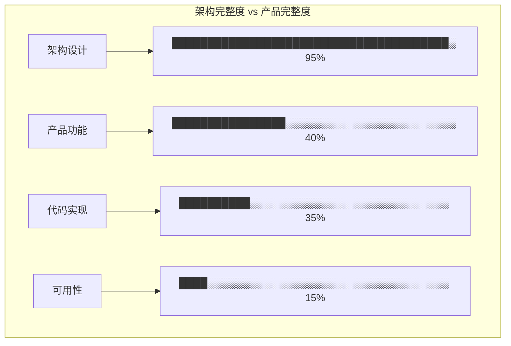

### 核心问题

| 问题 | 描述 | 影响 |
|------|------|------|
| 架构过度设计 | 追求LLVM级别的完美 | 开发周期无限延长 |
| 范围蔓延 | 不断增加新能力 | 永远无法完成 |
| 缺少MVP | 没有最小可行产品 | 无法验证市场需求 |
| 工程债务 | 设计远超前于实现 | 团队疲劳、产品难产 |

---

## 二、回到核心：本平台真正解决什么问题？

### 用户最痛的点

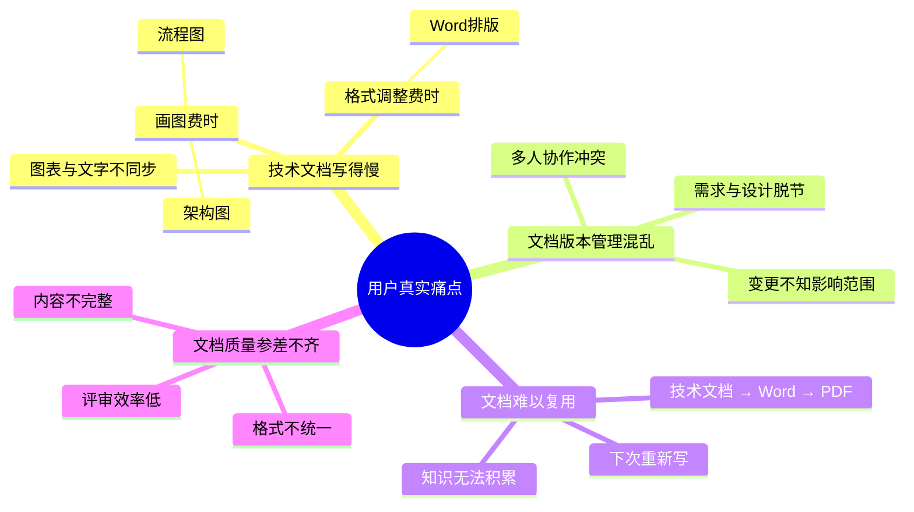

### 核心价值主张

> **"让技术人员像写代码一样写文档"**

用最熟悉的Markdown写作，自动生成专业的Word/PDF文档。

---

## 三、建议演进路线

### 阶段一：核心可用（MVP）—— 当前最重要

**目标**：让用户真正能用起来，解决80%的日常需求

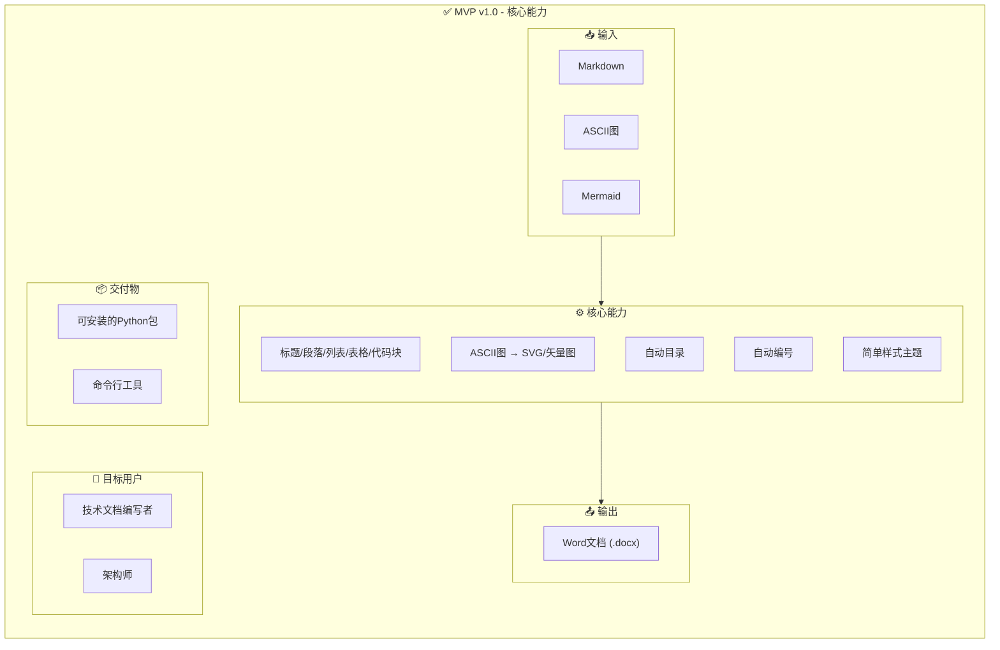

**MVP实现代码结构**（精简版）：

```
doc-compiler/
├── src/
│   ├── core/
│   │   ├── converter.py      # 主转换器
│   │   └── config.py         # 配置
│   ├── parser/
│   │   └── markdown.py       # Markdown解析（含Mermaid/ASCII）
│   ├── renderer/
│   │   └── word.py           # Word渲染
│   └── cli.py                # 命令行入口
├── tests/
├── README.md
└── setup.py
```

### 阶段二：体验优化（产品化）

**目标**：让用户用得更舒服、更高效

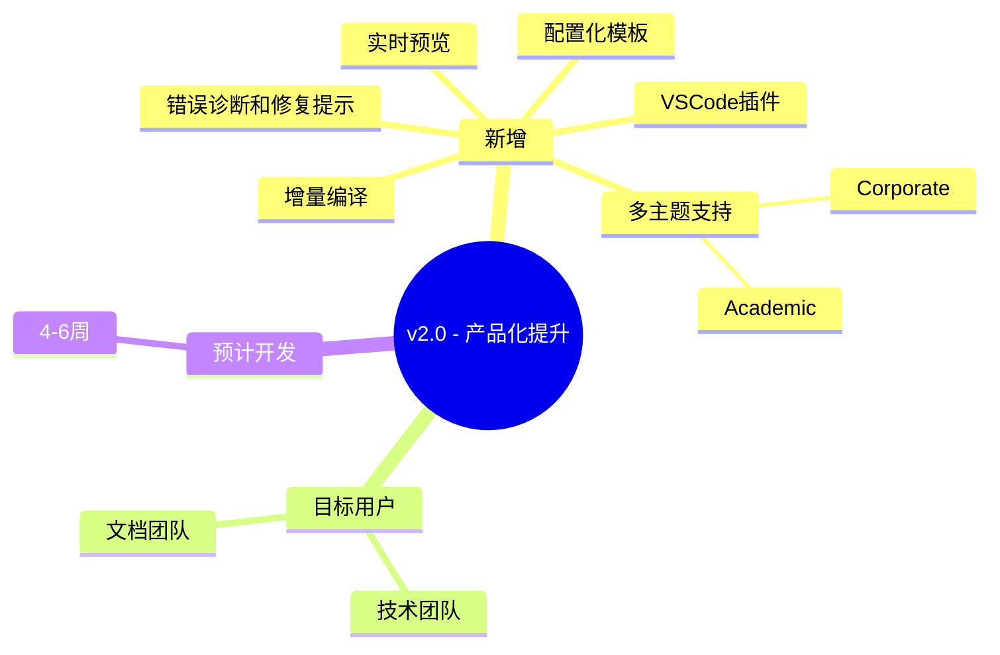

### 阶段三：协作与知识（团队级）

**目标**：支持团队协作和知识管理

```
mindmap
  root((v3.0 - 团队协作))
    新增功能
      Workspace
        多文档管理
      需求追踪
        REQ-001 → Design → Test
      影响分析
        修改一处，标记所有受影响
      知识图谱基础
      多格式输出
        PDF
        HTML
    目标用户
      研发团队
      产品团队
    预计开发
      8-12周
```

### 阶段四：智能平台（企业级）

**目标**：AI驱动、知识管理、企业级部署

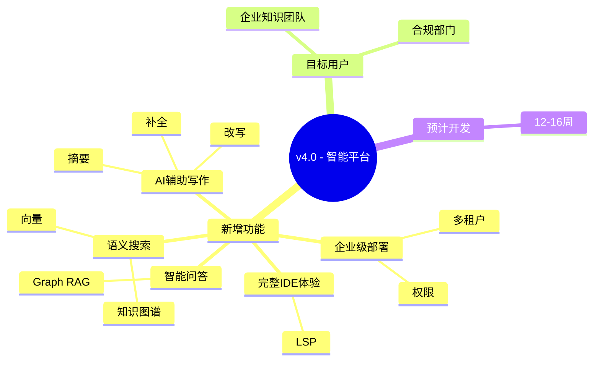

---

## 四、MVP详细设计

### 核心功能清单

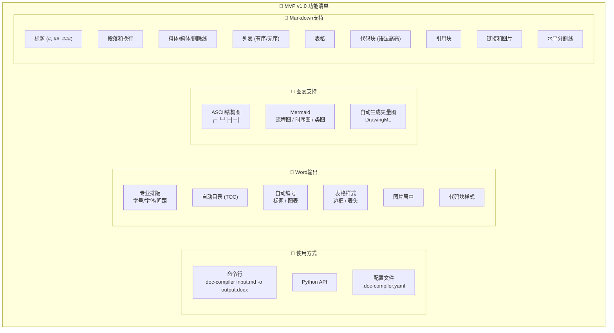

### 简单实现架构

```python
# src/core/converter.py - 核心转换器（精简版）

import re
from pathlib import Path
from typing import List, Dict, Any

from src.parser.markdown import MarkdownParser
from src.renderer.word import WordRenderer
from src.utils.logger import get_logger


class DocumentConverter:
    """
    文档转换器 - MVP版本
    只有核心能力，没有过度设计
    """
    
    def __init__(self, config: Dict[str, Any] = None):
        self.config = config or {}
        self.logger = get_logger(__name__)
        
        # 核心组件
        self.parser = MarkdownParser()
        self.renderer = WordRenderer()
    
    def convert(self, input_path: Path, output_path: Path) -> Path:
        """
        转换Markdown到Word
        
        Args:
            input_path: 输入Markdown文件路径
            output_path: 输出Word文件路径
            
        Returns:
            输出文件路径
        """
        self.logger.info(f"Converting: {input_path} → {output_path}")
        
        # 1. 读取文件
        with open(input_path, 'r', encoding='utf-8') as f:
            content = f.read()
        
        # 2. 解析Markdown
        ast = self.parser.parse(content)
        
        # 3. 渲染Word
        self.renderer.render(ast, output_path, self.config)
        
        return output_path


# src/parser/markdown.py - Markdown解析器（精简版）

import re
from typing import List, Dict, Any
from dataclasses import dataclass


@dataclass
class Node:
    """AST节点 - 极简设计"""
    type: str
    text: str = ""
    children: List['Node'] = None
    metadata: Dict[str, Any] = None
    
    def __post_init__(self):
        if self.children is None:
            self.children = []
        if self.metadata is None:
            self.metadata = {}


class MarkdownParser:
    """
    Markdown解析器 - MVP版本
    只支持最常用的Markdown语法
    """
    
    def parse(self, content: str) -> Node:
        """解析Markdown内容为AST"""
        lines = content.split('\n')
        root = Node(type='document')
        
        i = 0
        while i < len(lines):
            line = lines[i]
            
            # 标题
            if line.startswith('#'):
                level = len(line) - len(line.lstrip('#'))
                text = line.lstrip('#').strip()
                node = Node(type='heading', text=text, metadata={'level': level})
                root.children.append(node)
                i += 1
                continue
            
            # 代码块
            if line.startswith('```'):
                language = line[3:].strip()
                code_lines = []
                i += 1
                while i < len(lines) and not lines[i].startswith('```'):
                    code_lines.append(lines[i])
                    i += 1
                node = Node(
                    type='code_block',
                    text='\n'.join(code_lines),
                    metadata={'language': language}
                )
                root.children.append(node)
                i += 1
                continue
            
            # 列表
            if re.match(r'^[\-\*\+]\s+', line):
                nodes = self._parse_list(lines, i)
                root.children.extend(nodes)
                i += len(nodes)
                continue
            
            # 表格
            if line.startswith('|'):
                nodes = self._parse_table(lines, i)
                root.children.extend(nodes)
                i += len(nodes)
                continue
            
            # ASCII图
            if self._is_ascii_diagram(line):
                nodes = self._parse_ascii_diagram(lines, i)
                root.children.extend(nodes)
                i += len(nodes)
                continue
            
            # Mermaid图
            if '```mermaid' in line:
                nodes = self._parse_mermaid(lines, i)
                root.children.extend(nodes)
                i += len(nodes)
                continue
            
            # 普通段落
            if line.strip():
                node = Node(type='paragraph', text=line)
                root.children.append(node)
            
            i += 1
        
        return root
    
    def _parse_list(self, lines: List[str], start: int) -> List[Node]:
        """解析列表"""
        # TODO: 实现列表解析
        return [Node(type='list', text='list')]
    
    def _parse_table(self, lines: List[str], start: int) -> List[Node]:
        """解析表格"""
        # TODO: 实现表格解析
        return [Node(type='table', text='table')]
    
    def _parse_ascii_diagram(self, lines: List[str], start: int) -> List[Node]:
        """解析ASCII图"""
        # TODO: 实现ASCII图解析
        return [Node(type='diagram', text='ascii')]
    
    def _parse_mermaid(self, lines: List[str], start: int) -> List[Node]:
        """解析Mermaid图"""
        # TODO: 实现Mermaid解析
        return [Node(type='diagram', text='mermaid')]
    
    def _is_ascii_diagram(self, line: str) -> bool:
        """检测是否为ASCII图"""
        chars = set('┌┐└┘├┤┬┴┼─│')
        return any(c in chars for c in line)
```

---

## 五、开发优先级

### P0 - 必须完成（MVP）

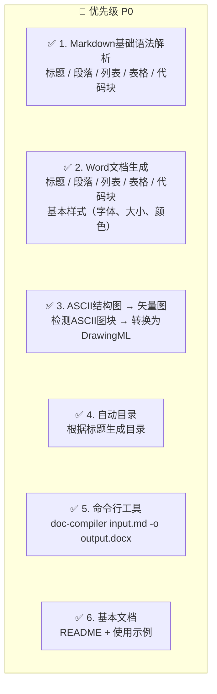

### P1 - 重要但可延后（v2.0）

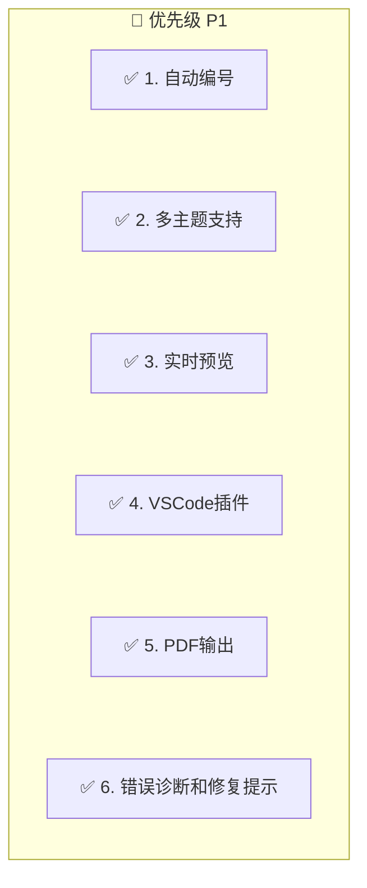

### P2 - 锦上添花（v3.0+）

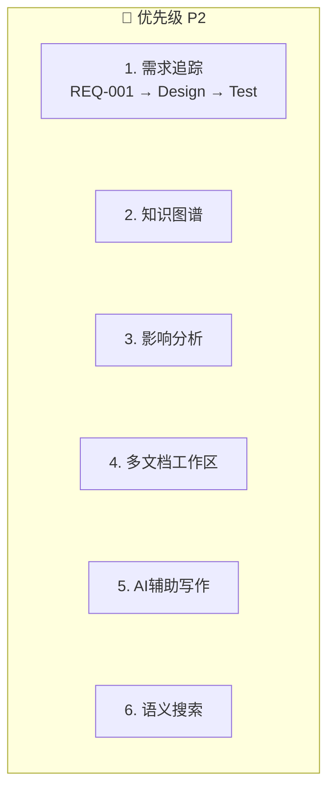

---

## 六、立即行动清单

### 本周可以开始的工作

| 任务 | 时间 | 产出 |
|------|------|------|
| 1. 精简代码，只保留核心能力 | 1天 | 清理后的代码库 |
| 2. 实现Markdown基础解析 | 2天 | 支持标题/段落/列表/表格 |
| 3. 实现Word基础渲染 | 2天 | 生成可用的Word文档 |
| 4. 实现ASCII图转换 | 1天 | ASCII → 矢量图 |
| 5. 集成测试 | 1天 | 端到端工作流 |

### 第一周交付物

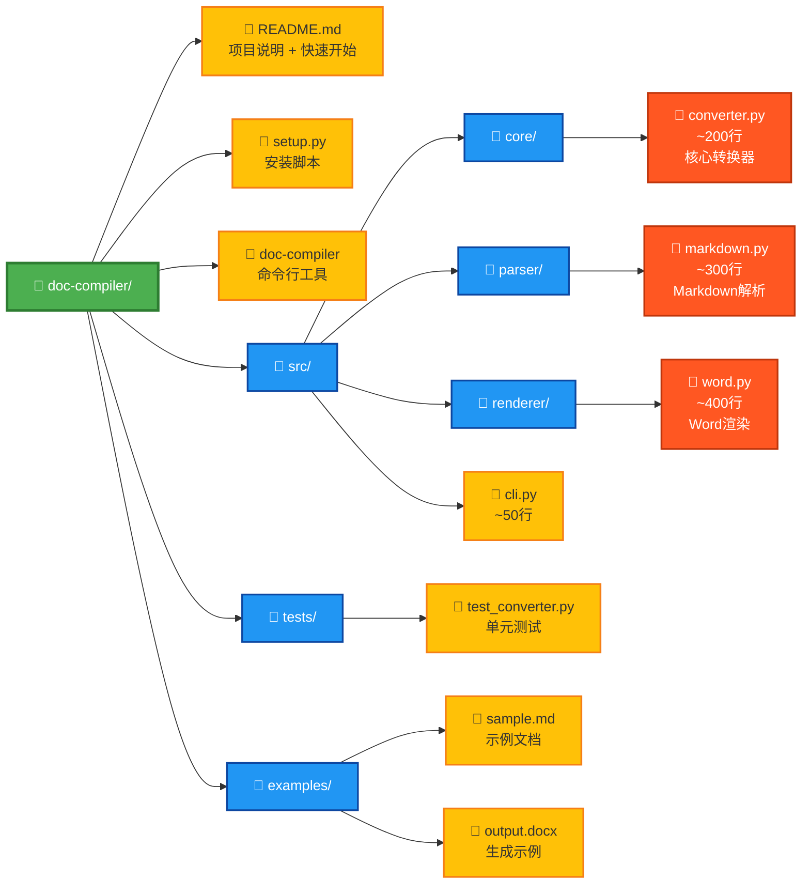

### 验证标准

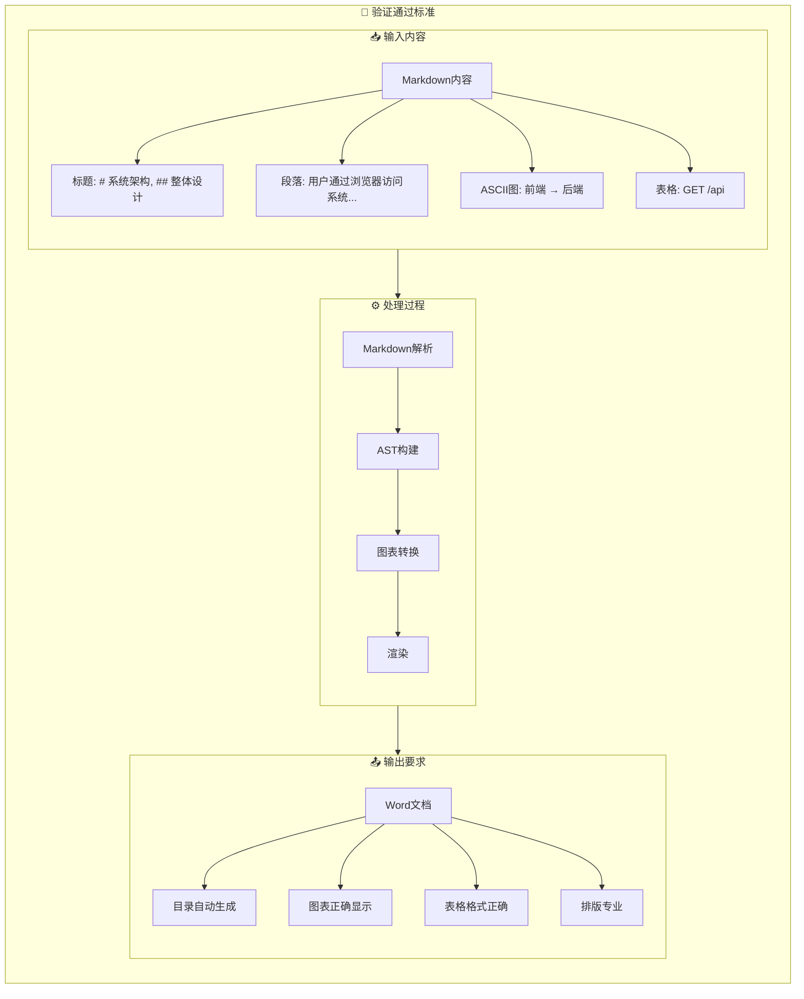

---

## 七、核心建议

### 1. 停止设计，开始交付

```
当前状态：95% 设计 + 35% 代码 → 永远在"设计"
目标状态：20% 设计 + 80% 代码 + 100% 交付
```

### 2. MVP三原则

| 原则 | 说明 |
|------|------|
| **够用即可** | 不追求完美，只要能解决核心问题 |
| **快速验证** | 2-3周内让用户用起来 |
| **持续迭代** | 根据反馈不断改进 |

### 3. 放弃的假设

```
❌ 需要支持所有Markdown语法 → ✅ 只支持最常用的80%
❌ 需要完美的架构 → ✅ 够用的架构，后续重构
❌ 需要支持所有输出格式 → ✅ 只支持Word，后续扩展
❌ 需要知识图谱 → ✅ 先让用户能用起来
❌ 需要AI集成 → ✅ 先做好基础功能
```

### 4. 成功标准

> **"2周后，有10个用户真正在用这个工具写技术文档"**

---

## 总结

| 问题 | 当前状态 | 建议 |
|------|---------|------|
| 架构 | 95% 完成 | 停止设计，开始编码 |
| 代码 | 35% 完成 | 聚焦MVP，快速交付 |
| 产品 | 15% 完成 | 2周内推出可用的v1.0 |
| 用户 | 0 用户 | 用产品吸引第一批用户 |

**立即行动：**

1. 梳理当前代码，删除不必要的抽象
2. 确定MVP功能清单（不超过10个功能）
3. 每天交付可工作的代码
4. 2周后发布v1.0
5. 根据用户反馈迭代

**记住：**

> 一个正在使用的v0.1，远比一个完美的v1.0更有价值。