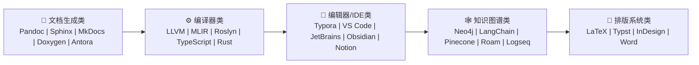

## 一、核心对标产品矩阵



---

## 二、详细对标分析

### 1. 文档生成类

#### 1.1 Pandoc

| 维度 | Pandoc | 本平台 | 优势说明 |
|------|--------|--------|---------|
| **定位** | 文档转换器 | 文档编译器平台 | 本平台不仅是转换工具，更是编译+知识平台 |
| **输入格式** | 40+ 格式 | 聚焦Markdown生态系统 | 本平台对Mermaid/PlantUML等深度支持 |
| **输出格式** | 50+ 格式 | DOCX/PDF/HTML/PPTX | 更专注于企业文档输出 |
| **图表支持** | 有限 | 原生支持 | Mermaid/PlantUML/ASCII → 矢量图 |
| **语义分析** | ❌ | ✅ | 本平台理解Requirement/Risk/Decision |
| **知识图谱** | ❌ | ✅ | 自动构建知识图谱 |
| **增量编译** | ❌ | ✅ | 只重新编译变化部分 |
| **LSP支持** | ❌ | ✅ | IDE级别编辑体验 |

**Pandoc优势**：
- 格式覆盖广
- 成熟稳定
- 社区庞大

**本平台优势**：
- 企业级文档语义理解
- 知识图谱自动构建
- 实时编辑体验
- 影响分析和追踪


#### 1.2 Sphinx

| 维度 | Sphinx | 本平台 | 优势说明 |
|------|--------|--------|---------|
| **定位** | Python文档生成器 | 通用文档编译器 | 本平台语言无关 |
| **输出** | HTML/PDF | 全格式 | 更丰富的输出选择 |
| **主题系统** | ✅ | ✅ | 两者都支持 |
| **交叉引用** | ✅ | ✅ | 本平台支持更智能的引用 |
| **图表支持** | 有限 | 原生 | Mermaid/PlantUML/ASCII |
| **知识图谱** | ❌ | ✅ | 自动构建知识图谱 |
| **AI集成** | ❌ | ✅ | Graph RAG, 智能问答 |
| **实时预览** | ❌ | ✅ | Typora风格 |

**Sphinx优势**：
- Python生态集成
- reStructuredText支持
- 成熟稳定

**本平台优势**：
- 实时编辑预览
- 知识图谱与推理
- 更丰富的图表支持
- 企业级扩展能力


#### 1.3 MkDocs / Material for MkDocs

| 维度 | MkDocs | 本平台 | 优势说明 |
|------|--------|--------|---------|
| **定位** | 项目文档 | 企业文档平台 | 本平台覆盖更广场景 |
| **实时预览** | ✅ | ✅ | 两者都支持 |
| **主题系统** | ✅ | ✅ | 本平台支持更专业主题 |
| **搜索** | 全文搜索 | 语义+图谱+向量 | 本平台搜索更智能 |
| **图表支持** | 有限 | 原生 | 本平台支持更多图表类型 |
| **知识图谱** | ❌ | ✅ | 本平台自动构建知识图谱 |
| **Word导出** | ❌ | ✅ | 本平台原生支持 |
| **增量编译** | ❌ | ✅ | 本平台支持大型文档 |

**MkDocs优势**：
- 简单易用
- 主题丰富
- 社区活跃

**本平台优势**：
- Word/PDF企业级输出
- 知识图谱与智能搜索
- 增量编译
- 需求追踪


#### 1.4 Doxygen

| 维度 | Doxygen | 本平台 | 优势说明 |
|------|--------|--------|---------|
| **定位** | 代码文档生成 | 通用文档平台 | 本平台支持更广泛内容 |
| **代码解析** | ✅ | ✅ | 本平台支持更多语言 |
| **架构图** | 自动 | 手动+自动 | 本平台更灵活 |
| **知识图谱** | ❌ | ✅ | 本平台构建知识图谱 |
| **影响分析** | ❌ | ✅ | 本平台分析变更影响 |
| **跨文档追踪** | ❌ | ✅ | 需求→设计→实现→测试 |

**Doxygen优势**：
- 代码自动文档
- 架构图自动生成
- 成熟稳定

**本平台优势**：
- 需求→设计→测试全链路
- 知识图谱与推理
- 企业级编辑体验


#### 1.5 Antora

| 维度 | Antora | 本平台 | 优势说明 |
|------|--------|--------|---------|
| **定位** | 多仓库文档 | 企业知识平台 | 本平台更完整 |
| **多版本** | ✅ | 规划中 | Antora版本支持成熟 |
| **多仓库** | ✅ | 规划中 | Antora多仓库支持 |
| **本地编辑** | ❌ | ✅ | 本平台支持本地编辑 |
| **知识图谱** | ❌ | ✅ | 本平台构建知识图谱 |
| **AI集成** | ❌ | ✅ | 本平台支持AI |

**Antora优势**：
- 多仓库/多版本支持
- 文档站点生成
- 分布式文档

**本平台优势**：
- 本地编辑体验
- 知识图谱
- AI智能能力


### 2. 编译器类

#### 2.1 LLVM

| 维度 | LLVM | 本平台 | 优势说明 |
|------|------|--------|---------|
| **定位** | 代码编译器 | 文档编译器 | 架构思想一致 |
| **Pipeline** | ✅ | ✅ | 两者都是多阶段编译 |
| **Pass System** | ✅ | ✅ | 本平台采用LLVM风格 |
| **IR** | LLVM IR | 多层IR | 本平台有更多IR层次 |
| **Analysis** | ✅ | ✅ | 本平台有Analysis Manager |
| **Incremental** | ✅ | ✅ | 本平台支持增量编译 |
| **前端扩展** | ✅ | ✅ | 两者都支持多种输入 |

**LLVM优势**：
- 成熟稳定
- 性能优化
- 社区庞大

**本平台优势**：
- 文档专用优化
- 知识图谱集成
- 业务语义理解


#### 2.2 MLIR

| 维度 | MLIR | 本平台 | 优势说明 |
|------|------|--------|---------|
| **定位** | 多层级IR | 文档编译器 | 思想高度一致 |
| **多层IR** | ✅ | ✅ | 本平台采用多层IR设计 |
| **Dialect** | ✅ | 语义层 | 本平台有Semantic AST |
| **Pass** | ✅ | ✅ | 本平台采用Pass Framework |

**MLIR优势**：
- 灵活性高
- 性能优化
- 硬件适配

**本平台优势**：
- 文档语义理解
- 知识图谱集成
- 企业级应用


#### 2.3 Roslyn (.NET Compiler Platform)

| 维度 | Roslyn | 本平台 | 优势说明 |
|------|--------|--------|---------|
| **定位** | 代码编译器 | 文档编译器 | 架构思想一致 |
| **Workspace** | ✅ | ✅ | 本平台有Workspace支持 |
| **Incremental** | ✅ | ✅ | 本平台支持增量编译 |
| **LSP** | ✅ | ✅ | 本平台有LSP Server |
| **Analysis** | ✅ | ✅ | 本平台有Analysis Manager |

**Roslyn优势**：
- 成熟稳定
- IDE集成
- 性能优化

**本平台优势**：
- 文档业务语义
- 知识图谱
- 跨平台


### 3. 编辑器/IDE类

#### 3.1 Typora

| 维度 | Typora | 本平台 | 优势说明 |
|------|--------|--------|---------|
| **定位** | Markdown编辑器 | 文档IDE | 本平台是完整平台 |
| **实时预览** | ✅ | ✅ | 本平台支持实时预览 |
| **Source Map** | ✅ | ✅ | 本平台有完整Source Map |
| **主题系统** | ✅ | ✅ | 本平台支持主题系统 |
| **图表支持** | ✅ | ✅ | 本平台支持Mermaid/PlantUML |
| **知识图谱** | ❌ | ✅ | 本平台构建知识图谱 |
| **多格式输出** | 有限 | ✅ | 本平台支持DOCX/PDF/HTML |
| **编译器功能** | ❌ | ✅ | 本平台是编译器 |

**Typora优势**：
- 用户体验优秀
- 简洁易用
- 实时预览流畅

**本平台优势**：
- 企业级知识管理
- 多格式发布
- 完整编译管道
- AI集成


#### 3.2 VS Code

| 维度 | VS Code | 本平台 | 优势说明 |
|------|---------|--------|---------|
| **定位** | 代码编辑器 | 文档IDE | 定位不同但思想一致 |
| **LSP** | ✅ | ✅ | 本平台有文档LSP |
| **Workspace** | ✅ | ✅ | 本平台有Workspace |
| **插件系统** | ✅ | ✅ | 本平台有插件系统 |
| **Git集成** | ✅ | 规划中 | VS Code更成熟 |
| **调试** | ✅ | N/A | 不同领域 |

**VS Code优势**：
- 生态丰富
- 性能优秀
- 社区庞大

**本平台优势**：
- 文档专用优化
- 知识图谱
- 编译能力


#### 3.3 JetBrains IDEs

| 维度 | JetBrains | 本平台 | 优势说明 |
|------|-----------|--------|---------|
| **定位** | IDE | 文档IDE | 思想一致 |
| **代码分析** | ✅ | ✅ | 本平台分析文档 |
| **重构** | ✅ | ✅ | 本平台支持重构 |
| **LSP** | ✅ | ✅ | 本平台有LSP |
| **增量编译** | ✅ | ✅ | 本平台支持增量编译 |

**JetBrains优势**：
- 深度语言支持
- 性能优秀
- 企业级功能

**本平台优势**：
- 文档业务语义
- 知识图谱
- AI集成


### 4. 知识图谱类

#### 4.1 Obsidian

| 维度 | Obsidian | 本平台 | 优势说明 |
|------|----------|--------|---------|
| **定位** | 知识管理 | 文档知识平台 | 本平台更完整 |
| **双向链接** | ✅ | ✅ | 本平台支持 |
| **知识图谱** | ✅ | ✅ | 本平台构建知识图谱 |
| **关系推理** | 有限 | ✅ | 本平台有推理引擎 |
| **多格式输出** | ❌ | ✅ | 本平台支持DOCX/PDF/HTML |
| **AI集成** | 有限 | ✅ | 本平台支持Graph RAG |
| **LSP** | ❌ | ✅ | 本平台有LSP |
| **编译能力** | ❌ | ✅ | 本平台是编译器 |

**Obsidian优势**：
- 用户体验优秀
- 插件生态丰富
- 本地优先

**本平台优势**：
- 文档编译能力
- 多格式发布
- AI推理
- 企业级功能


#### 4.2 Notion

| 维度 | Notion | 本平台 | 优势说明 |
|------|--------|--------|---------|
| **定位** | 协作平台 | 文档知识平台 | 本平台更专注技术文档 |
| **实时协作** | ✅ | 规划中 | Notion协作成熟 |
| **数据库** | ✅ | ✅ | 本平台有知识图谱 |
| **AI** | ✅ | ✅ | 本平台有Graph RAG |
| **导出** | 有限 | ✅ | 本平台支持更多格式 |
| **本地编辑** | ❌ | ✅ | 本平台支持本地编辑 |

**Notion优势**：
- 协作功能完善
- 数据库灵活
- 生态丰富

**本平台优势**：
- 技术文档支持
- 本地编辑
- 多格式导出
- 知识推理


### 5. 排版系统类

#### 5.1 LaTeX

| 维度 | LaTeX | 本平台 | 优势说明 |
|------|-------|--------|---------|
| **定位** | 排版系统 | 文档编译器 | 本平台现代化 |
| **排版质量** | ✅ | ✅ | 本平台支持专业排版 |
| **数学公式** | ✅ | ✅ | 本平台支持 |
| **引用管理** | ✅ | ✅ | 本平台支持 |
| **学习曲线** | 陡峭 | 平缓 | 本平台更易用 |
| **实时预览** | ❌ | ✅ | 本平台支持实时预览 |
| **知识图谱** | ❌ | ✅ | 本平台构建知识图谱 |
| **AI集成** | ❌ | ✅ | 本平台支持AI |

**LaTeX优势**：
- 排版质量极高
- 数学支持完善
- 学术标准

**本平台优势**：
- 易学易用
- 实时预览
- 知识图谱
- AI集成


#### 5.2 Typst

| 维度 | Typst | 本平台 | 优势说明 |
|------|-------|--------|---------|
| **定位** | 排版系统 | 文档编译器 | 思想一致 |
| **编译器架构** | ✅ | ✅ | 两者都是编译器 |
| **增量编译** | ✅ | ✅ | 本平台支持 |
| **实时预览** | ✅ | ✅ | 本平台支持 |
| **数学公式** | ✅ | ✅ | 本平台支持 |
| **知识图谱** | ❌ | ✅ | 本平台构建知识图谱 |
| **AI集成** | ❌ | ✅ | 本平台支持AI |

**Typst优势**：
- 排版质量高
- 编译速度快
- 语法简洁

**本平台优势**：
- 知识图谱
- AI集成
- 多格式输出
- 企业级功能


### 6. AI集成类

#### 6.1 LangChain

| 维度 | LangChain | 本平台 | 优势说明 |
|------|-----------|--------|---------|
| **定位** | AI框架 | 文档知识平台 | 本平台专注文档 |
| **RAG** | ✅ | ✅ | 本平台有Graph RAG |
| **Agent** | ✅ | 规划中 | LangChain更成熟 |
| **向量存储** | ✅ | ✅ | 本平台支持 |
| **知识图谱** | ✅ | ✅ | 本平台有知识图谱 |

**LangChain优势**：
- AI生态丰富
- 组件灵活
- 社区活跃

**本平台优势**：
- 文档专用优化
- 知识图谱深度集成
- 企业级文档支持


---

## 三、本平台的核心优势

### 1. 唯一能力矩阵

| 能力 | Pandoc | Sphinx | Typora | Obsidian | LaTeX | LLVM | 本平台 |
|------|--------|--------|--------|----------|-------|------|--------|
| 文档编译 | ✅ | ✅ | ❌ | ❌ | ✅ | N/A | ✅ |
| 实时预览 | ❌ | ❌ | ✅ | ❌ | ❌ | N/A | ✅ |
| 知识图谱 | ❌ | ❌ | ❌ | ✅ | ❌ | N/A | ✅ |
| 语义分析 | ❌ | ❌ | ❌ | ❌ | ❌ | N/A | ✅ |
| 增量编译 | ❌ | ❌ | ❌ | ❌ | ✅ | ✅ | ✅ |
| AI集成 | ❌ | ❌ | ❌ | ❌ | ❌ | N/A | ✅ |
| LSP支持 | ❌ | ❌ | ❌ | ❌ | ❌ | N/A | ✅ |
| 多格式输出 | ✅ | ✅ | ❌ | ❌ | ✅ | N/A | ✅ |
| 影响分析 | ❌ | ❌ | ❌ | ❌ | ❌ | N/A | ✅ |
| 需求追踪 | ❌ | ❌ | ❌ | ❌ | ❌ | N/A | ✅ |
| 推理引擎 | ❌ | ❌ | ❌ | ❌ | ❌ | N/A | ✅ |

### 2. 技术架构优势

```
┌─────────────────────────────────────────────────────────────┐
│                    本平台 vs 其他系统                        │
├─────────────────────────────────────────────────────────────┤
│                                                             │
│  Pandoc/Sphinx：                                           │
│  Markdown → Word                                           │
│  ⚠️ 只做转换，不理解内容                                    │
│                                                             │
│  Typora/Obsidian：                                         │
│  Markdown → Editor                                         │
│  ⚠️ 只有编辑，没有编译                                      │
│                                                             │
│  LLVM/Roslyn：                                             │
│  Code → Compiler → IR → Binary                            │
│  ✅ 编译器思想，但不处理文档                                │
│                                                             │
│  本平台：                                                   │
│  Markdown → Syntax AST → Semantic AST → Canonical AST     │
│  → Pass → IR → Layout → Graphics → Renderer               │
│  → Knowledge Graph → Reasoner → AI                        │
│  ✅ 编译器思想 + 文档语义 + 知识图谱 + AI                   │
└─────────────────────────────────────────────────────────────┘
```

### 3. 业务价值优势

| 维度 | 传统工具 | 本平台 |
|------|---------|--------|
| **文档编写** | 手动 | AI辅助 + 实时预览 |
| **需求追踪** | 手动表格 | 自动追踪矩阵 |
| **影响分析** | 人工判断 | 自动分析 |
| **知识管理** | 文档堆叠 | 知识图谱 |
| **智能搜索** | 关键词搜索 | 语义+向量+图谱 |
| **变更管理** | 人工review | 自动影响分析 |
| **格式转换** | 单向 | 多格式高质量输出 |

---

## 四、总结

### 对标矩阵

| 对标系统 | 相似度 | 说明 |
|----------|--------|------|
| LLVM | ★★★★★ | 编译器架构、Pass Framework、IR设计 |
| MLIR | ★★★★☆ | 多层IR、语义层设计 |
| Roslyn | ★★★★☆ | Workspace、增量编译、LSP |
| Typora | ★★★★★ | 实时预览、Source Map、编辑体验 |
| VS Code | ★★★★☆ | LSP、Workspace、插件系统 |
| Obsidian | ★★★★☆ | 知识图谱、双向链接 |
| Pandoc | ★★★★☆ | 多格式输出、文档转换 |
| Sphinx | ★★★★☆ | 文档生成、交叉引用 |
| LaTeX | ★★★★☆ | 排版质量、引用管理 |
| LangChain | ★★★★☆ | RAG、向量存储、AI集成 |

### 核心差异化

**1. 编译器架构 + 文档语义**

不仅转换文档，而是理解文档的业务语义（需求、风险、决策），这是传统文档工具不具备的。

**2. 知识图谱 + AI推理**

自动构建知识图谱，支持影响分析、需求追踪、智能问答，将文档转化为可查询的知识资产。

**3. 完整平台体验**

从编辑、编译、分析、推理到发布的全链路支持，在单一平台上完成文档全生命周期管理。

**4. 四层架构**

IDE Layer、Compiler Layer、Runtime Layer、Knowledge Platform，层次清晰，可持续扩展。

**5. 企业级能力**

Workspace、增量编译、LSP、诊断、事务、多格式输出，满足企业级需求。

### 一句话定位

> **本平台 = LLVM的编译器架构 + Typora的编辑体验 + Obsidian的知识图谱 + LangChain的AI能力**

这是一个面向企业级文档知识工程的**下一代文档编译平台**。