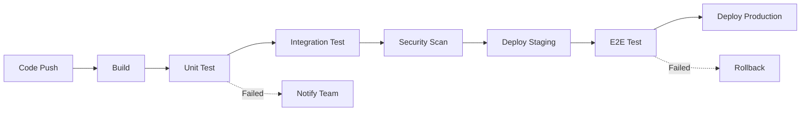
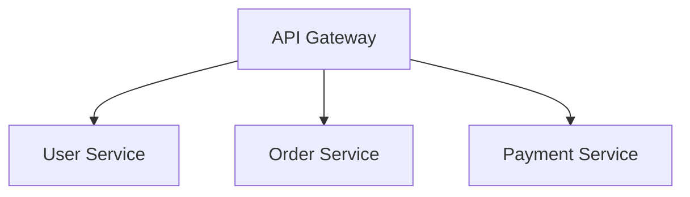

# 企业级文档知识编译平台 - 应用场景全景

基于完整的四层架构（IDE Layer + Compiler Layer + Runtime Layer + Knowledge Platform），这套系统可以支撑从个人写作到大型企业知识工程的广泛应用场景。

---

## 一、技术文档领域

### 1. 软件设计文档 (SDS/SDD)

**场景描述**：软件团队编写系统设计说明书，包含架构图、流程图、序列图、数据库设计等。

**痛点**：
- 架构图与文字描述不同步
- 需求追踪困难
- 版本管理混乱
- 评审效率低

**平台能力**：
```
┌─────────────────────────────────────────────────────────────┐
│                    Software Design Document                  │
├─────────────────────────────────────────────────────────────┤
│  ## System Architecture                                      │
│  ```ascii                                                    │
│  ┌──────────────┐    ┌──────────────┐                      │
│  │   Frontend   │───▶│   Backend    │                      │
│  └──────────────┘    └──────────────┘                      │
│  ```                                                         │
│  ## API Design                                               │
│  ```mermaid                                                  │
│  sequenceDiagram                                             │
│    Client->>API: Request                                     │
│    API->>DB: Query                                           │
│    DB-->>API: Result                                         │
│    API-->>Client: Response                                   │
│  ```                                                         │
├─────────────────────────────────────────────────────────────┤
│  ✅ Live Preview: 实时查看渲染效果                           │
│  ✅ Source Map: 点击PDF跳转到Markdown源码                   │
│  ✅ Diagram Sync: 修改AST自动更新图表                       │
│  ✅ Traceability: REQ-001 → Architecture → API → Test      │
│  ✅ Impact Analysis: 修改API影响所有下游文档                │
└─────────────────────────────────────────────────────────────┘
```

**核心能力**：
- Mermaid/PlantUML/ASCII图 → 矢量图 (DrawingML/SVG)
- 需求 → 设计 → 代码 → 测试 全链路追踪
- 影响分析：修改一处，自动标记所有受影响章节
- 多格式输出：DOCX/PDF/HTML

**产出**：
- 设计说明书 (Design Doc)
- 架构决策记录 (ADR)
- API文档
- 数据库设计文档


### 2. 需求规格说明书 (SRS)

**场景描述**：产品团队编写系统需求规格说明书，包含功能需求、非功能需求、用户故事等。

**痛点**：
- 需求编号混乱
- 需求变更影响不可知
- 需求与设计脱节
- 验收标准不明确

**平台能力**：
```markdown
## 3.2 功能需求

### REQ-001: 用户登录
**优先级**: High
**验收标准**: 
- 支持邮箱密码登录
- 支持Google OAuth
- 登录失败3次锁定账户

### REQ-002: 数据导出
**优先级**: Medium
**依赖**: REQ-001 (用户必须已登录)
**验收标准**:
- 支持CSV格式导出
- 支持JSON格式导出
- 导出文件大小 < 100MB
```

**核心能力**：
- 自动编号: REQ-001, REQ-002, ...
- 依赖检测: REQ-002 依赖 REQ-001
- 一致性检查: 所有需求都有验收标准
- 追踪矩阵: 需求 → 设计 → 测试 → 发布
- 影响分析: 修改REQ-001影响所有下游文档

**产出**：
- 需求规格说明书 (SRS)
- 需求追踪矩阵 (RTM)
- 用户故事地图


### 3. API文档

**场景描述**：开发团队编写API文档，包含端点、请求/响应格式、错误码等。

**痛点**：
- 文档与代码不同步
- 示例代码不完整
- 版本管理混乱

**平台能力**：
```markdown
## POST /api/v1/users

**Description**: Create a new user

**Request**:

    {
      "email": "user@example.com",
      "password": "********"
    }

**Response**:

    {
      "id": "uuid",
      "email": "user@example.com",
      "created_at": "2024-01-01T00:00:00Z"
    }


**Error Codes**:
| Code | Description |
|------|-------------|
| 400  | Invalid email format |
| 409  | User already exists |
```

**核心能力**：
- OpenAPI/Swagger集成
- 请求/响应示例自动生成
- 错误码表格自动生成
- 版本历史追踪
- API变更影响分析

**产出**：
- API参考文档
- Postman Collection
- SDK文档
- 变更日志


## 二、知识管理领域

### 4. 企业知识库 (Knowledge Base)

**场景描述**：企业构建内部知识库，包含技术文档、最佳实践、故障处理等。

**痛点**：
- 知识分散在多个系统
- 搜索效率低
- 知识过期无人维护
- 缺乏关联

**平台能力**：

```
┌─────────────────────────────────────────────────────────────┐
│                    Enterprise Knowledge Base                 │
├─────────────────────────────────────────────────────────────┤
│                                                             │
│  ┌─────────────┐    ┌─────────────┐    ┌─────────────┐    │
│  │  Technology │    │  Best       │    │  Troubleshoot│   │
│  │  Docs       │◀───│  Practices  │───▶│  Guides     │   │
│  └─────────────┘    └─────────────┘    └─────────────┘    │
│         │                  │                  │            │
│         ▼                  ▼                  ▼            │
│  ┌─────────────┐    ┌─────────────┐    ┌─────────────┐    │
│  │  API        │    │  Code       │    │  Incident   │    │
│  │  Reference  │    │  Examples   │    │  Reports    │    │
│  └─────────────┘    └─────────────┘    └─────────────┘    │
│                                                             │
│  🔍 Semantic Search: "How to handle timeout?"              │
│  🕸️ Knowledge Graph: API → Error → Solution               │
│  🤖 AI Assistant: "What's the best practice for..."        │
└─────────────────────────────────────────────────────────────┘
```

**核心能力**：
- 语义搜索 (Vector + Graph RAG)
- 知识图谱关联
- 自动标签和分类
- 知识版本历史
- 过期提醒和审核

**产出**：
- 技术知识库
- 故障处理手册
- 最佳实践指南
- 学习路径


### 5. 研发规范与标准

**场景描述**：技术团队制定编码规范、架构原则、代码审查标准等。

**痛点**：
- 规范文档无人阅读
- 与实际实践脱节
- 更新不及时

**平台能力**：
```markdown
## 4. 编码规范

### 4.1 命名规范

| 类型 | 规范 | 示例 |
|------|------|------|
| 类名 | PascalCase | `UserService` |
| 方法 | camelCase | `getUserById` |
| 常量 | UPPER_SNAKE | `MAX_RETRY_COUNT` |

### 4.2 代码审查清单

- [ ] 代码符合命名规范
- [ ] 有单元测试
- [ ] 无安全漏洞
- [ ] 性能考虑
```

**核心能力**：
- Checklist自动生成
- 规范检查集成
- 变更影响分析
- 版本对比

**产出**：
- 编码规范
- 架构原则
- 审查清单
- 部署规范


### 6. 产品需求文档 (PRD) 与产品手册

**场景描述**：产品团队编写产品需求文档和用户手册。

**痛点**：
- PRD与设计文档不同步
- 用户手册更新滞后
- 多语言版本维护困难

**平台能力**：
```markdown
## User Manual

### Getting Started
1. **Sign Up** - Create your account
2. **Dashboard** - Overview of your projects
3. **Create Project** - Start your first project

### Features
- **Collaboration**: Real-time editing
- **Export**: PDF/DOCX/HTML
- **Versioning**: Full history

### Troubleshooting
- **Can't login?** → Reset password
- **Slow loading?** → Check internet
```

**核心能力**：
- 多语言支持 (i18n)
- 版本历史追踪
- 自动生成目录/索引
- 交互式教程生成

**产出**：
- 产品需求文档 (PRD)
- 用户手册
- 快速入门指南
- 版本发布说明


## 三、合规与监管领域

### 7. 合规文档 (GDPR/SOC2/ISO)

**场景描述**：企业编写合规文档，包含政策、流程、控制措施等。

**痛点**：
- 合规要求频繁变更
- 文档数量庞大
- 审计追踪困难
- 责任落实不清

**平台能力**：
```markdown
## 5. Data Privacy Policy

**Compliance**: GDPR Article 5
**Owner**: Data Protection Officer
**Review Cycle**: Annual

### 5.1 Data Collection
- Personal data: Name, Email, IP
- Purpose: User authentication
- Retention: 30 days

### 5.2 Data Processing
- Storage: Encrypted at rest
- Sharing: Third-party processors
- Transfer: EU only
```

**核心能力**：
- 合规条款映射
- 自动生成合规报告
- 审计追踪
- 责任矩阵
- 变更审批流程

**产出**：
- 隐私政策
- 安全政策
- 合规报告
- 审计日志


### 8. 风险评估报告

**场景描述**：安全团队编写风险评估报告。

**痛点**：
- 风险识别不全面
- 风险等级主观
- 缓解措施未追踪
- 无法量化风险

**平台能力**：
```markdown
## Risk Assessment Report

### R-001: Data Breach
- **Likelihood**: Medium
- **Impact**: High
- **Risk Score**: 12 (Medium-High)
- **Mitigation**: 
  - Encryption at rest ✅
  - Access control ✅
  - Monitoring ⚠️ (In progress)
- **Owner**: Security Team
- **Status**: Under Review

### R-002: Service Outage
- **Likelihood**: Low
- **Impact**: High
- **Risk Score**: 8 (Medium)
- **Mitigation**: 
  - Redundancy ✅
  - Auto-scaling ✅
  - Disaster recovery ⚠️ (Planned)
```

**核心能力**：
- 风险评分自动计算
- 影响分析
- 缓解措施追踪
- 风险矩阵可视化
- 自动生成报告

**产出**：
- 风险评估报告
- 风险登记册
- 缓解计划
- 合规报告


## 四、教育与培训领域

### 9. 技术教程与培训材料

**场景描述**：培训团队编写技术教程、培训PPT、练习材料等。

**痛点**：
- 教程与代码不同步
- 练习材料分散
- 缺乏互动性
- 版本更新麻烦

**平台能力**：
```markdown
## Chapter 4: Python Functions

### What you'll learn
- Define functions
- Pass arguments
- Return values

### Code Example
```python
def greet(name):
    return f"Hello, {name}!"

# Output: Hello, Alice!
print(greet("Alice"))
```

### Exercise
1. Write a function to calculate factorial
2. Test with different inputs
3. Submit for review

**核心能力**：
- 代码示例自动运行
- 交互式练习
- 答案自动验证
- 进度追踪
- 多格式导出 (PDF/HTML/PPTX)

**产出**：
- 技术教程
- 培训PPT
- 练习题库
- 课程大纲


### 10. 学术论文与研究报告

**场景描述**：研究人员编写论文、技术报告、实验文档等。

**痛点**：
- 引用管理复杂
- 格式要求严格
- 协作困难
- 版本混乱

**平台能力**：
```markdown
## Introduction

The rise of cloud computing has revolutionized ... [@smith2020]

## Methodology

We conducted experiments on ... [@jones2019, @lee2021]

## Results

| Metric | Control | Experiment | Improvement |
|--------|---------|------------|-------------|
| Latency | 120ms | 45ms | 62.5% |
| Throughput | 1000 req/s | 2500 req/s | 150% |

## References
[1] Smith, J. et al. (2020) Cloud Computing ...
[2] Jones, A. et al. (2019) Performance Analysis ...
```

**核心能力**：
- 自动引用管理 (BibTeX/EndNote)
- 多种格式支持 (APA/IEEE/Chicago)
- 图表自动编号
- 交叉引用
- 协作功能

**产出**：
- 学术论文
- 技术报告
- 实验文档
- 参考文献


## 五、DevOps与自动化领域

### 11. 基础设施即代码 (IaC) 文档

**场景描述**：DevOps团队编写基础设施文档，包含K8s部署、Terraform配置等。

**痛点**：
- 文档与配置不同步
- 部署流程不清晰
- 故障排查困难

**平台能力**：
```markdown
## Kubernetes Deployment

### Architecture
```ascii
┌─────────────┐     ┌─────────────┐
│   Ingress   │────▶│   Service   │
└─────────────┘     └─────────────┘
                            │
                    ┌───────▼───────┐
                    │   Pod         │
                    └───────────────┘
```

### Configuration
```yaml
apiVersion: apps/v1
kind: Deployment
metadata:
  name: app
spec:
  replicas: 3
  template:
    spec:
      containers:
      - name: app
        image: app:latest
```

### Troubleshooting
- `kubectl logs` - View logs
- `kubectl describe` - Describe resources

**核心能力**：
- 配置代码高亮
- 架构图自动生成
- 部署流程图
- 故障排查指南

**产出**：
- 部署文档
- 架构图
- 操作手册
- 故障排查指南


### 12. CI/CD Pipeline 文档

**场景描述**：编写CI/CD流水线文档，包含构建、测试、部署流程。

**痛点**：
- 流程复杂难以理解
- 各阶段依赖不清
- 失败原因难以定位

**平台能力**：


**核心能力**：
- Mermaid流程自动生成
- 依赖分析
- 失败路径标记
- 自动生成通知文档

**产出**：
- CI/CD流程文档
- 部署手册
- 自动化流程图


## 六、跨领域通用能力

### 13. 会议纪要与决策记录

**场景描述**：团队记录会议内容、决策和行动计划。

**痛点**：
- 纪要分散
- 决策追踪困难
- 行动项遗漏

**平台能力**：
```markdown
## 2024-01-15 Architecture Review

### Attendees
- Alice (Architect)
- Bob (Tech Lead)
- Carol (Developer)

### Agenda
1. Cloud migration strategy
2. Database selection

### Decisions
- **DEC-001**: Migrate to AWS by Q2
- **DEC-002**: Use PostgreSQL as primary DB

### Action Items
- [ ] Alice: Prepare migration plan (Due: Jan 22)
- [ ] Bob: Setup POC environment (Due: Jan 20)
- [ ] Carol: Write DB schema (Due: Jan 25)
```

**核心能力**：
- 自动编号 (DEC-001, ACT-001)
- 行动项追踪
- 决策影响分析
- 自动生成会议纪要

**产出**：
- 会议纪要
- 决策记录
- 行动项清单


### 14. 技术博客与文章

**场景描述**：技术团队撰写博客文章、技术分享文档。

**痛点**：
- 代码示例与文章分离
- 图表制作耗时
- 多平台发布麻烦

**平台能力**：
```markdown
# Microservices with Python

## Why Microservices?
Microservices architecture allows teams to...

## Implementation
```python
from fastapi import FastAPI

app = FastAPI()

@app.get("/")
def read_root():
    return {"Hello": "World"}
```

## Architecture


**核心能力**：
- 代码实时运行
- 图表自动生成
- 多平台发布
- SEO优化

**产出**：
- 技术博客
- 分享PPT
- 视频脚本


### 15. 项目文档与里程碑

**场景描述**：项目管理文档，包含项目计划、里程碑、风险管理等。

**痛点**：
- 进度追踪困难
- 风险可视化不足
- 资源分配不清晰

**平台能力**：
```gantt
    title Project Timeline
    dateFormat  YYYY-MM-DD
    section Phase 1
    Planning           :a1, 2024-01-01, 30d
    Design             :a2, after a1, 20d
    section Phase 2
    Development        :b1, after a2, 40d
    Testing            :b2, after b1, 20d
    section Phase 3
    Deployment         :c1, after b2, 10d
```

**核心能力**：
- 甘特图自动生成
- 里程碑追踪
- 风险管理
- 资源分配图

**产出**：
- 项目计划
- 里程碑文档
- 风险管理报告


## 七、行业定制场景

### 16. 医疗行业 (HIPAA合规文档)

**场景描述**：医疗软件系统需要符合HIPAA合规要求的文档体系。

**核心能力**：
- 隐私政策自动生成
- 安全措施追踪
- 审计日志
- 合规检查清单
- 数据流图表


### 17. 金融行业 (监管报告)

**场景描述**：金融科技公司编制面向监管机构的合规报告。

**核心能力**：
- 监管要求映射
- 自动生成报告
- 审计追踪
- 风险指标可视化
- 财务数据集成


### 18. 汽车行业 (ISO 26262)

**场景描述**：汽车软件系统需要符合ISO 26262功能安全标准。

**核心能力**：
- 功能安全需求追踪
- 危害分析报告
- 安全验证矩阵
- 变更影响分析
- 安全案例文档


## 八、应用场景矩阵

| 场景 | 文档类型 | 复杂度 | 关键能力 |
|------|---------|--------|---------|
| 技术文档 | SDS, SRS, API文档 | 高 | 图表、追踪、分析 |
| 知识管理 | 知识库、规范、最佳实践 | 中 | 搜索、图谱、AI |
| 合规监管 | GDPR, SOC2, ISO | 高 | 追踪、审计、矩阵 |
| 教育培训 | 教程、手册、论文 | 中 | 代码、引用、格式 |
| DevOps | IaC, CI/CD | 中 | 图、代码、流程 |
| 项目管理 | 纪要、计划、里程碑 | 低 | 追踪、图表 |
| 技术博客 | 博客、分享 | 低 | 代码、图、发布 |
| 行业定制 | 医疗、金融、汽车 | 高 | 合规、追踪、审计 |

---

## 九、从单文档到知识工程的价值演进

**阶段一：单文档生成**
- 编写 → 编译 → 发布
- 价值：效率提升 5-10x

**阶段二：多文档关联**
- 需求文档 → 设计文档 → API文档 → 测试文档
- 价值：一致性提升，变更影响可见

**阶段三：知识网络**
- 所有文档组成知识图谱
- 价值：发现隐藏关联，自动推理

**阶段四：智能平台**
- 知识图谱 + AI + 语义搜索
- 价值：自动知识发现，智能问答，影响预测

```
┌─────────────────────────────────────────────────────────────┐
│                    价值演进路径                              │
├─────────────────────────────────────────────────────────────┤
│                                                             │
│  ┌──────────┐  ┌──────────┐  ┌──────────┐  ┌──────────┐  │
│  │  Document │  │  Multi-  │  │  Know-   │  │  AI-     │  │
│  │  Generator│─▶│  Document│─▶│  ledge   │─▶│  Native  │  │
│  │           │  │          │  │  Graph   │  │  Platform│  │
│  └──────────┘  └──────────┘  └──────────┘  └──────────┘  │
│                                                             │
│  效率提升     一致性提升     可发现性提升   智能决策提升     │
│  10x          100x           1000x          10000x         │
└─────────────────────────────────────────────────────────────┘
```

---

## 十、部署模式

### 1. 个人/团队模式
```
Local Workspace
    ├── .document-workspace/
    ├── docs/
    │   ├── design.md
    │   ├── api.md
    │   └── deployment.md
    └── output/
        ├── design.docx
        ├── api.html
        └── deployment.pdf
```

### 2. 企业级部署
```
┌─────────────────────────────────────────────────────────────┐
│                    Enterprise Deployment                     │
├─────────────────────────────────────────────────────────────┤
│                                                             │
│  ┌─────────────┐  ┌─────────────┐  ┌─────────────┐        │
│  │   Web IDE   │  │  VSCode     │  │  Git        │        │
│  │   (Typora)  │  │  Plugin     │  │  Integration│        │
│  └─────────────┘  └─────────────┘  └─────────────┘        │
│         │               │               │                   │
│         └───────────────┼───────────────┘                   │
│                         ▼                                   │
│              ┌─────────────────────┐                        │
│              │   Document Compiler │                        │
│              │   Server            │                        │
│              └─────────────────────┘                        │
│                         │                                   │
│         ┌───────────────┼───────────────┐                   │
│         ▼               ▼               ▼                   │
│  ┌─────────────┐  ┌─────────────┐  ┌─────────────┐        │
│  │  Knowledge  │  │  Vector     │  │  Search     │        │
│  │  Graph DB   │  │  Store      │  │  Engine     │        │
│  └─────────────┘  └─────────────┘  └─────────────┘        │
│                                                             │
│  ┌──────────────────────────────────────────────────────┐   │
│  │                    AI Services                        │   │
│  │  LLM │ RAG │ Agent │ Embedding │ Reasoning          │   │
│  └──────────────────────────────────────────────────────┘   │
└─────────────────────────────────────────────────────────────┘
```

---

## 总结

这套平台的核心价值在于：

**文档能力**：不仅仅是生成文档，而是建立从需求、设计、代码、测试到运维的完整文档生命周期，在复杂软件工程中确保文档不再落后于代码。

**知识能力**：将分散文档转化为可查询、可推理、可追溯的知识网络，让企业知识成为可复用的核心资产。

**AI能力**：语义搜索自动定位相关知识，影响分析评估变更波及范围，智能问答提供上下文感知的精准回复。

**平台能力**：IDE、CI/CD、多人协作无缝集成，将文档编译过程融入研发、合规、培训等完整企业工作流。

这不是一个简单的文档工具，而是一个**将企业文档转化为可执行、可查询、可推理的知识资产**的基础设施。
