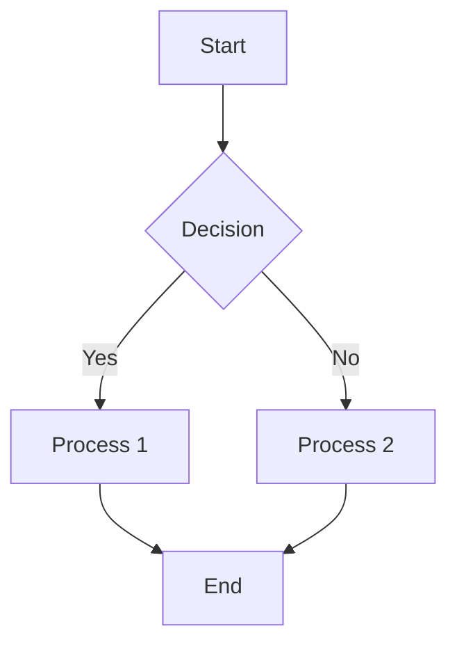
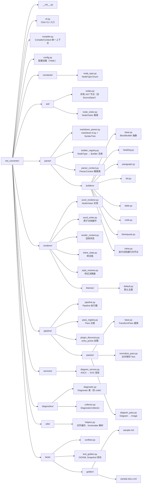
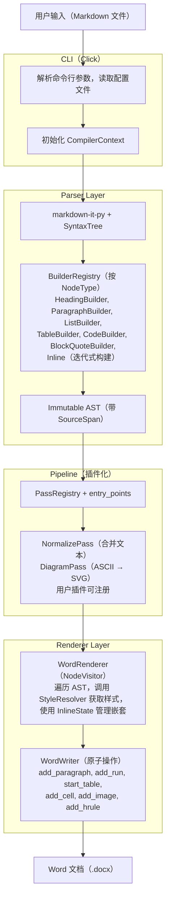
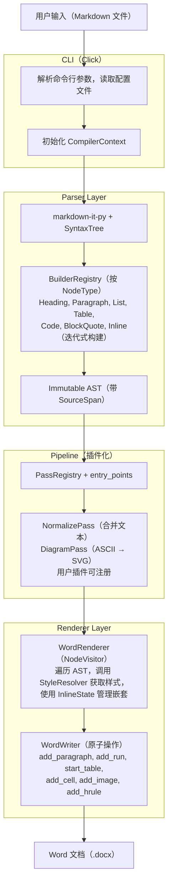

# Heading 1

## Heading 2

### Heading 3

#### Heading 4

##### Heading 5

###### Heading 6

---

## Text Formatting

**Bold text** and *italic text* and ***bold italic***.

`Inline code` with **bold** and *italic*.

---

## Lists

### Unordered List

- Item 1
- Item 2
  - Sub-item 2.1
  - Sub-item 2.2
- Item 3

### Ordered List

1. First item
2. Second item
3. Third item

### Task List

- [x] Completed task
- [ ] Pending task

---

## Tables

| Header 1 | Header 2 | Header 3 |
|----------|----------|----------|
| Cell 1.1 | Cell 1.2 | Cell 1.3 |
| Cell 2.1 | Cell 2.2 | Cell 2.3 |

---
# Mermaid Diagram Test


----

## Code Blocks

```python
def fibonacci(n):
    a, b = 0, 1
    for _ in range(n):
        yield a
        a, b = b, a + b
```		
### 目录结构与模块职责



### 整体架构



---


# Mermaid Diagram Test



---
	
