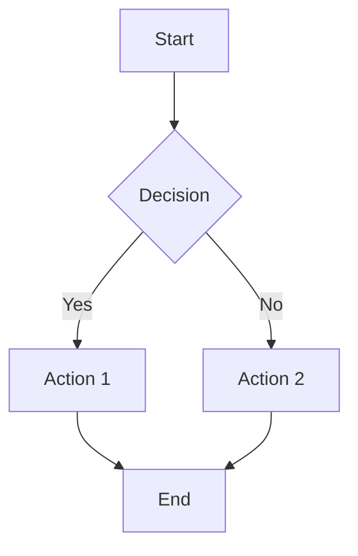
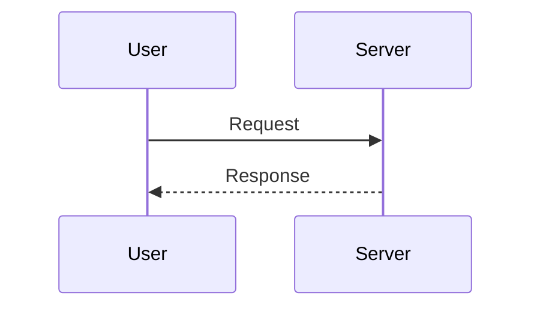

# Mermaid Diagram

```mermaid
flowchart TD
    A[Start] --> B{Decision}
    B -->|Yes| C[Action 1]
    B -->|No| D[Action 2]
    C --> E[End]
    D --> E
```

## Sequence Diagram

```mermaid
sequenceDiagram
    participant U as User
    participant S as Server
    U->>S: Request
    S-->>U: Response
```

Mermaid diagrams must be rendered as images or fall back to text without loss.
